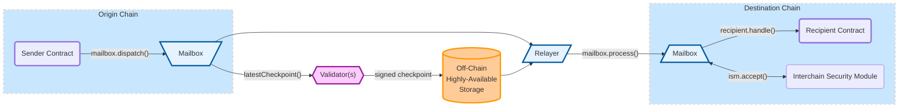

# Hyperlane Introduction

Hyperlane is the first [permissionless interoperability](protocol/permissionless-interoperability.md) layer. Empowering developers to bring interoperability functionality to any blockchain environment, whether it is a layer 1, a rollup, or an appchain. First of it's kind, Hyperlane is the only interoperability solution that can be [permissionlessly deployed](operators/deployers.md) on any chain, by anyone. With its modular architecture, notably its [Sovereign Consensus](protocol/sovereign-consensus.md), Hyperlane gives developers control over their security model, and an ability to choose from a menu of options augmented by strong defaults.&#x20;

With Hyperlane deployed on their chains of choice developers can start building Interchain Applications, apps that can serve users on any chain connected to Hyperlane. [Handling](apis/messaging-api/receive.md) the burden of interoperability on behalf of their users, and offering a superior experience.&#x20;

[Building with Hyperlane ](build-with-hyperlane/quickstarts/)means access to innovative middlewares such as Hyperlane's [Warp Routes](apis/warp-api.md) that provide developers with the ability to port over assets to any chain while leveraging all of the unique features that emerge from Hyperlane's modular architecture.

Keep reading to learn all about how you can leverage Hyperlane!

### **Hyperlane APIs**

Hyperlane's [APIs](./#hyperlane-apis) offer developers secure and simple ways to communicate between blockchains, while the Hyperlane [SDKs](broken-reference) make using Hyperlane and building interchain applications quick and easy.&#x20;

[messaging-api](apis/messaging-api/ "mention") [token-bridge-api.md](apis/token-bridge-api.md "mention") [accounts.md](apis/accounts.md "mention")[query.md](apis/query.md "mention")[warp-api.md](apis/warp-api.md "mention")

### Integrate Hyperlane into your app

Check out the [getting started guide](introduction/getting-started.md) for everything you need to start building with Hyperlane. If you run into an issues or have any questions, [join our discord](https://discord.gg/hyperlane) to get support from the community of Hyperlane builders!

### Learn more about the Hyperlane Protocol

Take a look at the [protocol docs](protocol/overview.md) to understand the Hyperlane protocol architecture and [security model](protocol/sovereign-consensus.md).

### Curious about what you should use Hyperlane for? Continue to the [next page](introduction/why-hyperlane/) to learn more&#x20;
