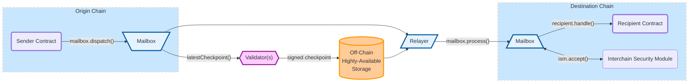

# Hyperlane Introduction

Hyperlane is permissionless and modular interoperability platform with focus on security assumptions. Empowering developers to build interchain applications that can communicate cross chain between blockchain environments.&#x20;

Hyperlane priority focus is developer experience and security of cross chain transfers offering it's users the best experience of cross chain protocol communication.

### **Cross chain API modules by Hyperlane**

Hyperlane provides set of various API modules as plug and play solution for their cross chain application. Hyperlane SDK can makes building interchain applications quick and easy. &#x20;

[messaging-api](api-reference/messaging-api/ "mention") [token-bridge-api.md](api-reference/token-bridge-api.md "mention") [send.md](api-reference/send.md "mention")[query.md](api-reference/query.md "mention")[warp-api.md](api-reference/warp-api.md "mention")

### Integrate Hyperlane into your app

Check out the [getting started guide](introduction/getting-started.md) for everything you need to start building with Hyperlane. If you run into an issues or have any questions, [join our discord](https://discord.gg/hyperlane) to get support from the community of Hyperlane builders!

### Learn more about Hyperlane Protocol

Take a look at the [protocol docs](protocol-reference/overview.md) to understand the Hyperlane protocol architecture and [security model](protocol-reference/sovereign-consensus.md).

### Learn more about Hyperlane use cases. Continue to the [next page](introduction/why-hyperlane/) to learn more&#x20;
