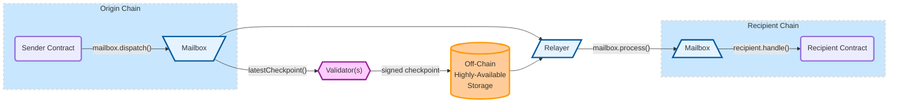

# Intro to Hyperlane

Hyperlane is the modular interoperability platform. Hyperlane empowers developers to build interchain applications, apps that can communicate between many blockchain environments and offer users a unified experience.&#x20;

Hyperlane's API's offer developers secure and simple ways to communicate between blockchains, and the Hyperlane SDK can makes building interchain applications quick and easy. &#x20;

### Looking to integrate Hyperlane?

Check out the [getting started guide](developers/getting-started.md) for ABIs, code examples, contract addresses, and more.

### Want to learn more about the protocol?

Take a look at the [protocol docs](protocol/overview.md) to understand the Hyperlane protocol architecture and [security model](protocol/security/).

### Why should you use Hyperlane? Continue to the [next page](introduction/why-hyperlane/) to learn more

### &#x20;


Hyperlane was originally named Abacus. For the time being you may encounter the name Abacus still referenced throughout the docs, github repos, and smart contracts.&#x20;

