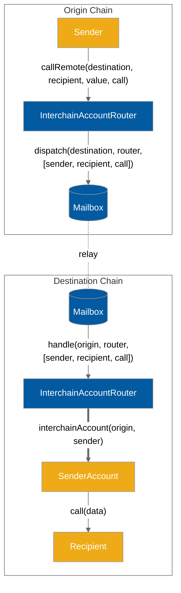

# Accounts API

Developers can use the Accounts API to create and control an account on a remote chain from their local chain.

Unlike the [messaging-api](../apis/messaging-api/ "mention"), which requires recipients to implement a specific interface, the Accounts API allows developers to interact with any remote contract.

The Accounts API assigns every `(uint32 origin, address owner, address remoteRouter, address remoteISM)` tuple a unique interchain account (ICA) address. The sender owns that ICA on the destination chain, and can direct it to make arbitrary function calls via the `InterchainAccountRouter.callRemote()` endpoint.

On many chains, you are able to use the defaults that are set by the owner of the router contract. See the [#overrides](accounts.md#overrides "mention") section to see how to make calls to any chain or use custom [sovereign-consensus](../protocol/sovereign-consensus/ "mention").

### Computing addresses

It may be useful to know the remote address of your ICA before sending a message. For example, you may want to first fund the address with tokens. The `getRemoteInterchainAccount` function can be used to get the address of an ICA given the destination chain and owner address.

An example is included below of a contract precomputing its own Interchain Account address.

```solidity
address myInterchainAccount = IInterchainAccountRouter(...).getRemoteInterchainAccount(
    destination,
    address(this)
);
```

### Interface

```solidity
// SPDX-License-Identifier: MIT OR Apache-2.0
pragma solidity >=0.6.11;

import {CallLib} from "../contracts/libs/Call.sol";

interface IInterchainAccountRouter {
    function callRemote(
        uint32 _destinationDomain,
        CallLib.Call[] calldata calls
    ) external returns (bytes32);

    function getRemoteInterchainAccount(uint32 _destination, address _owner)
        external
        view
        returns (address);
}

```


Want to use `InterchainAccountRouter`? Please refer to [addresses.md](../resources/addresses.md "mention") and [domains.md](../resources/domains.md "mention")


## Example Usage

### Encoding

The `callRemote` function takes as arguments an array of `Call` structs. `Call.data` can be easily encoded with the `abi.encodeCall` function.

<pre class="language-solidity"><code class="lang-solidity">struct Call {
    // supporting non EVM targets
    bytes32 to;
    uint256 value;
    bytes data;
}

<strong>interface IUniswapV3Pool {
</strong>    function swap(
        address recipient,
        bool zeroForOne,
        int256 amountSpecified,
        uint160 sqrtPriceLimitX96,
        bytes calldata data
    ) external returns (int256 amount0, int256 amount1);
}

IUniswapV3Pool pool = IUniswapV3Pool(...);
Call swapCall = Call({
    to: TypeCasts.addressToBytes32(address(pool)),
    data: abi.encodeCall(pool.swap, (...));
    value: 0,
});
uint32 ethereumDomain = 1;
IInterchainAccountRouter(0xabc...).callRemote(ethereumDomain, [swapCall]);
</code></pre>

### Computing addresses


There is a bug in address computation in the latest deployment that will result in the wrong address


It may be useful to know the remote address of your ICA before sending a message. For example, you may want to first fund the address with tokens. The `getRemoteInterchainAccount` function can be used to get the address of an ICA given the destination chain and owner address.

An example is included below of a contract precomputing its own interchain account address.

```solidity
address myInterchainAccount = IInterchainAccountRouter(...).getRemoteInterchainAccount(
    destination,
    address(this)
);
```

If you are using [#overrides](accounts.md#overrides "mention") to specify remote chains or [sovereign-consensus](../protocol/sovereign-consensus/ "mention"), pass those overrides when computing the remote ICA address.

```solidity
address myRemoteIca = IInterchainAccountRouter(...).getRemoteInterchainAccount(
    address(this),
    remoteRouterOverride,
    remoteIsmOverride
);
```

### Paying for Interchain Gas

Just like all Hyperlane messages that wish to have their messages delivered by a relayer, users must [pay for interchain gas](../build-with-hyperlane/guides/paying-for-interchain-gas.md).

The various `callRemote` functions in the Accounts API each return the message ID as a `bytes32`. This message ID can then be used by the caller to pay for interchain gas.

When specifying the amount of gas, the caller must pay for a gas amount high enough to cover:

1. "Overhead" gas used by the Accounts API contract and ISM on the destination chain. See the below table to understand what this will be.
2. The gas used by the user-specified arbitrary call(s) that will be performed by the interchain account.

#### Overhead gas amounts

For the very first message sent by a sender on the origin chain to a new destination domain, a higher overhead destination gas cost is incurred. This is because the interchain account must be created on the destination chain, which involves a new contract being deployed. Subsequent messages to an already-created interchain account have a much cheaper overhead.

| Interchain account already exists?                                                                                                                | Overhead Gas Amount |
| ------------------------------------------------------------------------------------------------------------------------------------------------- | ------------------- |
| No - this is the very first message from a `(uint32 origin, address owner)` pair to the destination, and a new interchain account will be created | 150,000             |
| Yes                                                                                                                                               | 30,000              |

#### Gas Payment Example

```solidity
function makeCall(uint256 gasAmount) external payable {
    // First, send the call
    uint32 ethereumDomain = 0x657468;
    // consistent across all chains
    address icaRouter = 0xc011170d9795a7a2d065E384EAd1CA3394A7d35E;
    bytes32 messageId = IInterchainAccountRouter(icaRouter).callRemote(
        ethereumDomain,
        address(pool),
        0,
        abi.encodeCall(pool.swap, (...))
    );

    // Then, pay for gas

    // The mainnet DefaultIsmInterchainGasPaymaster
    IInterchainGasPaymaster igp = IInterchainGasPaymaster(
        0x56f52c0A1ddcD557285f7CBc782D3d83096CE1Cc
    );
    // Pay with the msg.value
    igp.payForGas{ value: msg.value }(
         // The ID of the message
         messageId,
         // Destination domain
         ethereumDomain,
         // The total gas amount. This should be the
         // overhead gas amount + gas used by the call being made
         gasAmount,
         // Refund the msg.sender
         msg.sender
     );
}
```

## Overrides

The interchain accounts API allows developers to override the default chains and security models configured in the `InterchainAccountRouter`.

This can be useful for developers who wish to:

* Call an ICA on a chain that was not explicitly added by the `InterchainAccountRouter` owner, or
* Secure their ICA(s) using different [sovereign-consensus](../protocol/sovereign-consensus/ "mention") than the defaults configured in the `InterchainAccountRouter`

### Interface


The address of a remote ICA will vary with the `_router` and `_ism` overrides used


The `callRemoteWithOverrides` function looks similar to the `callRemote` function, but takes two additional arguments.

First, developers can override `_router`, the address of the `InterchainAccountRouter` on the remote chain. This allows developers to control an ICA on remote chains that have not been configured on the local `InterchainAccountRouter`.

Second, developers can override `_ism`, the address of the remote interchain security module (ISM) used to secure their ICA. This ISM will be used to verify the interchain messages passed between the local and remote `InterchainAccountRouters`. This allows developers to use a custom security model that best suits their needs.

Read more about [sovereign-consensus](../protocol/sovereign-consensus/ "mention").

```solidity
    /**
     * @notice Dispatches a sequence of remote calls to be made by an owner's
     * interchain account on the destination domain
     * @dev Recommend using CallLib.build to format the interchain calls
     * @param _destination The remote domain of the chain to make calls on
     * @param _router The remote router address
     * @param _ism The remote ISM address
     * @param _calls The sequence of calls to make
     * @return The Hyperlane message ID
     */
    function callRemoteWithOverrides(
        uint32 _destination,
        bytes32 _router,
        bytes32 _ism,
        CallLib.Call[] calldata _calls
    ) public returns (bytes32) 
```

## Diagram


