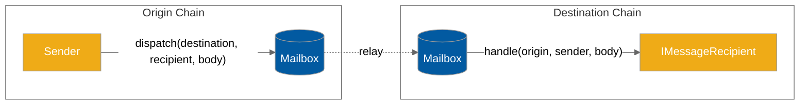

# Messaging API

Hyperlane provides an on-chain API for sending and receiving interchain messages.

Cant wait to get started? Follow the [messaging.md](../../build-with-hyperlane/quickstarts/messaging.md "mention") quickstart to send your first interchain message in less than five minutes. Otherwise, read on—

#### Interface

To [send.md](send.md "mention") interchain messages, reference the `Mailbox.dispatch()` API.

To [receive.md](receive.md "mention") interchain messages, implement the `IMessageRecipient` interface.

#### Testing

See the [unit-testing.md](../../build-with-hyperlane/guides/unit-testing.md "mention") documentation to see how to test your integration with the Hyperlane messaging API using the `MockMailbox` contracts.

#### Interchain gas

Delivering an interchain message requires submitting a transaction on the destination chain. Optionally, you can pay for the gas for this transaction on the origin chain, and let Hyperlane [relayers](../../operators/relayers/ "mention") deliver your message for you.

Learn more about [paying-for-interchain-gas](../../build-with-hyperlane/guides/developers/paying-for-interchain-gas/ "mention").
