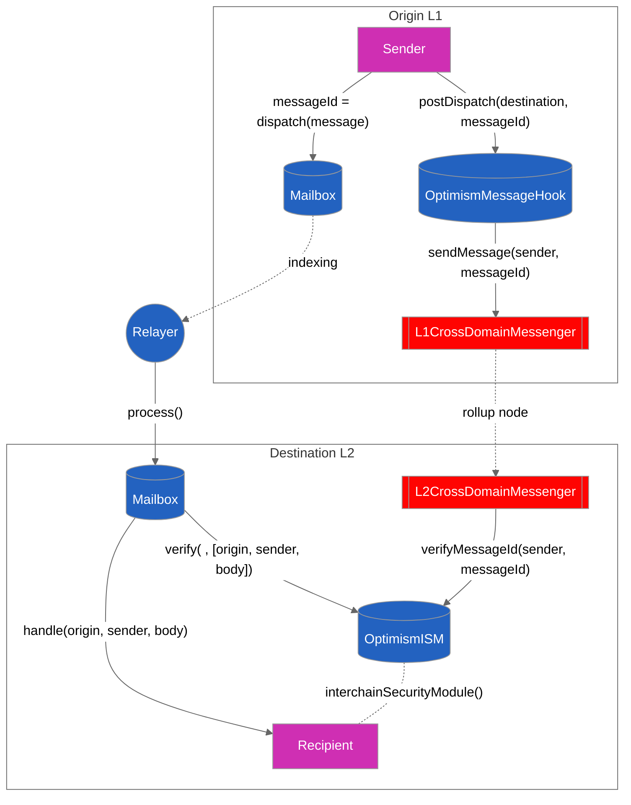

# Hooks API

## Overview

Developers can use the Hooks API to secure their messages either through native bridges like for Optimism or use other third-party bridge vendors.

There are cases where you may feel the MultisigISM or your own configured ISM security isn't sufficient for your application and instead you want the security of a native bridge like Optimism or a third-party vendor like Wormhole. You can opt-in to such do so with hooks without leaving the purview of the Mailbox interface and needing a bridge-specific implementation. Hooks can also be used as routes specified for the [aggregation-ism.md](../../protocol/sovereign-consensus/aggregation-ism.md "mention").

Hooks come in a pair of contracts, the `IMessageHook` on the source chain and `HookISM` on the destination chain. `IMessageHook` provides you the `postDispatch` method which you can call after `IMailbox.dispatch` providing the destination domain and the messageId. You pass on the `messageId` as payload to configured external provider (defined by the hook) which interacts with the corresponding `HookISM` contract on the destination chain. If the ISM can verify the validity of the messageId, the message can be delivered successfully by the relayer.

```mermaid
%%{ init: {
  "theme": "neutral",
  "themeVariables": {
    "mainBkg": "#2362c0",
    "textColor": "white",
    "clusterBkg": "white"
  },
  "themeCSS": ".edgeLabel { color: black }",
  "flowchart": {"useMaxWidth": "true" }
}}%%

flowchart TB
    Relayer((Relayer))

    subgraph Origin
      Sender
      M_O[(Mailbox)]
      Hook[(IMessageHook)]
      E_O[[External provider\n source]]

      Sender -- "messageId = dispatch(message)" --> M_O
      Sender -- "postDispatch(destination, messageId)" --> Hook
      Hook -- "sendMessage(sender, messageId)" --> E_O
    end


    M_O -. "indexing" .-> Relayer
    E_O -. "message passing" .-> E_D


    subgraph Destination
      Recipient
      M_D[(Mailbox)]
      ISM[(AbstractHookISM)]
      E_D[[External provider\n destination]]

      M_D -- "verify( , [origin, sender, body])" --> ISM
      M_D -- "handle(origin, sender, body)" --> Recipient
      ISM -. "interchainSecurityModule()" .- Recipient

      E_D -- "verifyMessageId(sender, messageId)" --> ISM
    end

    Relayer -- "process()" --> M_D

    style Sender fill: #cf2fb3
    style Recipient fill:#cf2fb3
    style E_O fill: #162a4a
    style E_D fill: #162a4a

```



**Note**: You need to deploy the `HookISM` contract on the destination chain and then you use this as the argument for the hook constructor (the `HookISM` contract address is immutable). Once you deploy the hook, you need to go back and set the hook address from the source chain.&#x20;

The last step is to configure the message recipient with the `HookISM`. Now, the message is secured by the underlying security mechanism of the hook. Currently, two hook types have been implemented. They are:

* **OptimismMessageHook** for sending messages using Optimism's native `CrossDomainMessenger` as the underlying message passing provider.&#x20;
* **ERC5164Hook** which can support any bridge provider which implements the ERC-5164 standard interface. Check out [multibridge](https://github.com/MultiMessageAggregation/multibridge) for some examples.

## Optimism Hook

Optimism and all the OP Stack chains use the `CrossDomainMessenger` interface for general message passing, `L1CrossDomainMessenger` to send messages from the L1 and the precompile `L2CrossDomainMessenger` to relay the messages onto L2. The canonical rollup bridge is the most  trust-minimized bridge because Ethereum is able to verify the rollup state of OP stack deployed on it.&#x20;

The `OptimismMessageHook` sends the messageId to the `L1CrossDomainMessenger` which registers it as an Optimism `TransactionDeposited` event with ETH deposit and message data which gets picked up by the rollup node.\
The rollup node calls the precompiled contract `L2CrossDomainMessenger`'s `relayMessage` function which in turn makes calls configured `OptimismISM` contract, setting the messageId in the `verifiedMessageId`'s mapping to the original L1 sender (ie. the user). The relayer carries just the message with no metadata, waiting for the Optimism node to pick and make a storage write to Optimism and the message delivery is then verified.&#x20;



Note: Optimism provides you with 1.92 million gas so you won't need to pay for L2 execution.&#x20;

#### Example usage

For using the hook, first make sure the corresponding OptimismISM has been deployed and they make an additional `postDispatch` call.

```solidity
// from l2
OptimismISM ism = new OptimismISM(l2Messenger);

// from l1
OptimismMessageHook hook = new OptimismMessageHook(destinationDomain, l1Messenger, address(ism));

// from l2
ism.setOptimismHook(address(hook));

// from l1
IMailbox mailbox = Mailbox(0x345...);

bytes32 messageId = mailbox.dispatch(destinationDomain, recipient, payload);
uint256 gasOverhead = hook.postDispatch(destinationDomain, messageId);
```

## ERC-5164 Hook

All ERC-5164 compatible bridge vendors have to implement contracts `IMessageDispatcher` and `IMessageExecutor`.&#x20;

The `ERC-5164` hook calls the dispatchMessage function on the `IMessageDispatcher` which send messages to IMessageExecutor at the specified toChainId. The executor contract has the special access to write to the `ERC5164ISM` contract, setting the messageId in the `verifiedMessageId`'s mapping to the original source chain sender (ie. the user).  The relayer carries just the message with no metadata, waiting for the  bridge provider to prove the validity and transport the message to the destination chain and the message delivery is then verified.&#x20;

This open interface allows any third party bridge provider like Wormhole or Telepathy to implement the interface and be supported by the ERC5164Hook out-of-the-box. This is especially useful if you want the reliability and security of a diverse set of bridge vendors by using the [aggregation-ism.md](../../protocol/sovereign-consensus/aggregation-ism.md "mention").

```mermaid
%%{ init: {
  "theme": "neutral",
  "themeVariables": {
    "mainBkg": "#2362c0",
    "textColor": "white",
    "clusterBkg": "white"
  },
  "themeCSS": ".edgeLabel { color: black }",
  "flowchart": {"useMaxWidth": "true" }
}}%%

flowchart TB
    Relayer((Relayer))

    subgraph Origin
      Sender
      M_O[(Mailbox)]
      Hook[(ERC5164MessageHook)]
      Dispatcher[[IMessageDispatcher]]

      Sender -- "messageId = dispatch()" --> M_O
      Sender -- "postDispatch(destination, messageId)" --> Hook
      Hook -- "dispatchMessage(toChainId, ism, payload)" --> Dispatcher
    end


    M_O -. "indexing" .-> Relayer
    Dispatcher -. "3rd party bridge" .-> Executor


    subgraph Destination
      Recipient
      M_D[(Mailbox)]
      ISM[(ERC5164ISM)]
      Executor[[IMessageExecutor]]

      M_D -- "verify( , [origin, sender, body])" --> ISM
      M_D -- "handle(origin, sender, body)" --> Recipient
      ISM -. "interchainSecurityModule()" .- Recipient

      Executor -- "verifyMessageId(sender, messageId)" --> ISM
    end

    Relayer -- "process()" --> M_D


    style Sender fill: #cf2fb3
    style Recipient fill:#cf2fb3
    style Dispatcher fill: #0b4445
    style Executor fill: #0b4445

```



#### Example usage

For using the hook, first make sure the corresponding ERC5164ISM has been deployed and they make an additional `postDispatch` call.

<pre class="language-solidity"><code class="lang-solidity"><strong>
</strong><strong>// from source
</strong><strong>ERC5164ISM ism = new ERC5164ISM(dispatcherAddress);
</strong><strong>
</strong><strong>// from l1
</strong><strong>ERC5164MessageHook hook = new ERC5164MessageHook(destinationDomain, executorAddress, address(ism));
</strong><strong>
</strong><strong>// from l2
</strong><strong>ism.setERC5164Hook(address(hook));
</strong><strong>
</strong><strong>// from l1
</strong>IMailbox mailbox = Mailbox(0x345...);

bytes32 messageId = mailbox.dispatch(destinationDomain, recipient, payload);
uint256 gasOverhead = hook.postDispatch(destinationDomain, messageId);
</code></pre>
