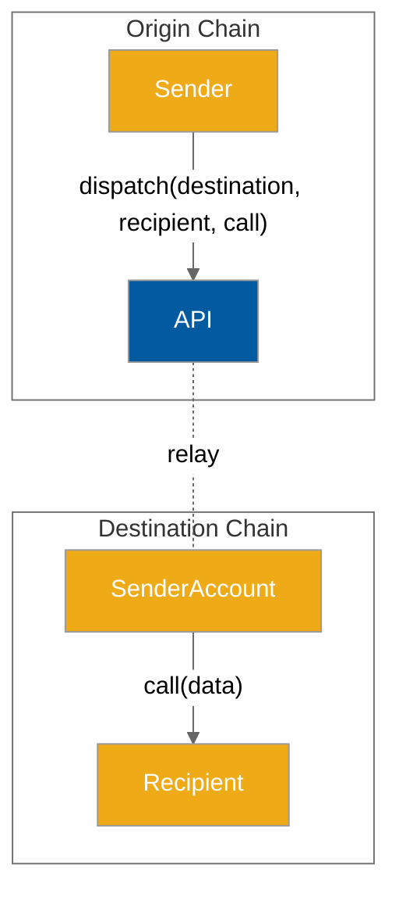
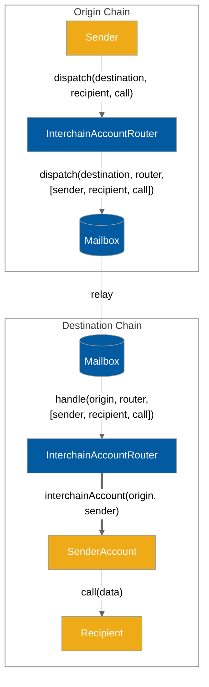

# Accounts API

Developers can use the Accounts API to create an account on a remote chain, and use that account to call smart contracts.

Unlike the [messaging-api](messaging-api/ "mention"), which requires recipients to implement a specific interface, the Accounts API allows developers to interact with any remote contract.

The Accounts API assigns every `(uint32 origin, address sender)` pair a unique interchain account address. The sender controls that address on all remote chains, and can direct it to make arbitrary function calls via the `InterchainAccountRouter.dispatch()` endpoint.

<!-- INCLUDE diagrams/accounts-simple.md -->
<!-- WARNING: copied from the included file path. Do not edit directly. -->

<!-- WARNING: copied from the included file path. Do not edit directly. -->
<!-- END -->

### Interface

<!-- INCLUDE node_modules/@hyperlane-xyz/core/interfaces/IInterchainAccountRouter.sol -->
<!-- WARNING: copied from the included file path. Do not edit directly. -->
```solidity
// SPDX-License-Identifier: MIT OR Apache-2.0
pragma solidity >=0.6.11;

import {CallLib} from "../contracts/libs/Call.sol";

interface IInterchainAccountRouter {
    function dispatch(uint32 _destinationDomain, CallLib.Call[] calldata calls)
        external
        returns (bytes32);

    function getInterchainAccount(uint32 _originDomain, bytes32 _sender)
        external
        view
        returns (address payable);

    function getInterchainAccount(uint32 _originDomain, address _sender)
        external
        view
        returns (address payable);
}

```
<!-- WARNING: copied from the included file path. Do not edit directly. -->
<!-- END -->

`InterchainAccountRouters`  can be found at `0xc011170d9795a7a2d065E384EAd1CA3394A7d35E` and domain IDs can be found [here](../resources/domains.md).

## Example Usage

### Encoding

You can either pass a call directly in arguments to the `dispatch` function or construct an array of `Call` structs. Calls can be easily encoded with the `abi.encodeCall` function.

```solidity
interface IUniswapV3Pool {
    function swap(
        address recipient,
        bool zeroForOne,
        int256 amountSpecified,
        uint160 sqrtPriceLimitX96,
        bytes calldata data
    ) external returns (int256 amount0, int256 amount1);
}

IUniswapV3Pool pool = IUniswapV3Pool(...);
Call swapCall = Call({
    to: address(pool),
    data: abi.encodeCall(pool.swap, (...));
});
```

### Sending

Perform a Uniswap V3 swap on Ethereum via an Interchain Account from a controlling account on another chain. The Interchain Account must satisfy any requirements the receiving contract has on `msg.sender`, such as token balances or allowances.

```solidity
uint32 ethereumDomain = 0x657468;
 // consistent across all chains
address icaRouter = 0xc011170d9795a7a2d065E384EAd1CA3394A7d35E;
IInterchainAccountRouter(icaRouter).dispatch(
    ethereumDomain,
    address(pool),
    abi.encodeCall(pool.swap, (...))
);
```

### Precomputing Addresses

It is often useful to have knowledge of the Interchain Account address before sending a message. For example, you may want to fund the address with tokens before sending a message. The `getInterchainAccount` function can be used to get the address of an Interchain Account given the controlling chain domain and address pair.

An example is included below of a contract precomputing its own Interchain Account address.

```solidity
address myInterchainAccount = IInterchainAccountRouter(...).getInterchainAccount(
    localDomain,
    address(this)
);
```

### Paying for Interchain Gas

Just like all Hyperlane messages that wish to have their messages delivered by a relayer, users must [pay for interchain gas](../build-with-hyperlane/guides/developers/paying-for-interchain-gas/).

The various `dispatch` functions in the Accounts API each return the message ID as a `bytes32`. This message ID can then be used by the caller to pay for interchain gas.

Because the Accounts API uses the default ISM for security, the [DefaultIsmInterchainGasPaymaster](../resources/addresses.md#defaultisminterchaingaspaymaster) IGP should be used. When specifying the amount of gas, the caller must pay for a gas amount high enough to cover:

1. "Overhead" gas used by the Accounts API contract on the destination chain. See the below table to understand what this will be.
2. The gas used by the user-specified arbitrary call(s) that will be performed by the interchain account.

#### Overhead gas amounts

For the very first message sent by a sender on the origin chain to a new destination domain, a higher overhead destination gas cost is incurred. This is because the Interchain Account must be created on the destination chain, which involves a new contract being deployed. Subsequent messages to an already-created Interchain Account have a much cheaper overhead.

| Interchain Account Already Exists?                                                                                                                 | Overhead Gas Amount |
| -------------------------------------------------------------------------------------------------------------------------------------------------- | ------------------- |
| No - this is the very first message from a `(uint32 origin, address sender)` pair to the destination, and a new Interchain Account will be created | 425,000             |
| Yes                                                                                                                                                | 30,000              |

#### Gas Payment Example

```solidity
function makeCall(uint256 gasAmount) external payable {
    // First, send the call
    uint32 ethereumDomain = 0x657468;
    // consistent across all chains
    address icaRouter = 0xc011170d9795a7a2d065E384EAd1CA3394A7d35E;
    bytes32 messageId = IInterchainAccountRouter(icaRouter).dispatch(
        ethereumDomain,
        address(pool),
        abi.encodeCall(pool.swap, (...))
    );

    // Then, pay for gas

    // The mainnet DefaultIsmInterchainGasPaymaster
    IInterchainGasPaymaster igp = IInterchainGasPaymaster(
        0x56f52c0A1ddcD557285f7CBc782D3d83096CE1Cc
    );
    // Pay with the msg.value
    igp.payForGas{ value: msg.value }(
         // The ID of the message
         messageId,
         // Destination domain
         ethereumDomain,
         // The total gas amount. This should be the
         // overhead gas amount + gas used by the call being made
         gasAmount,
         // Refund the msg.sender
         msg.sender
     );
}
```

### How it works

<!-- INCLUDE diagrams/accounts-implementation.md -->
<!-- WARNING: copied from the included file path. Do not edit directly. -->

<!-- WARNING: copied from the included file path. Do not edit directly. -->
<!-- END -->
