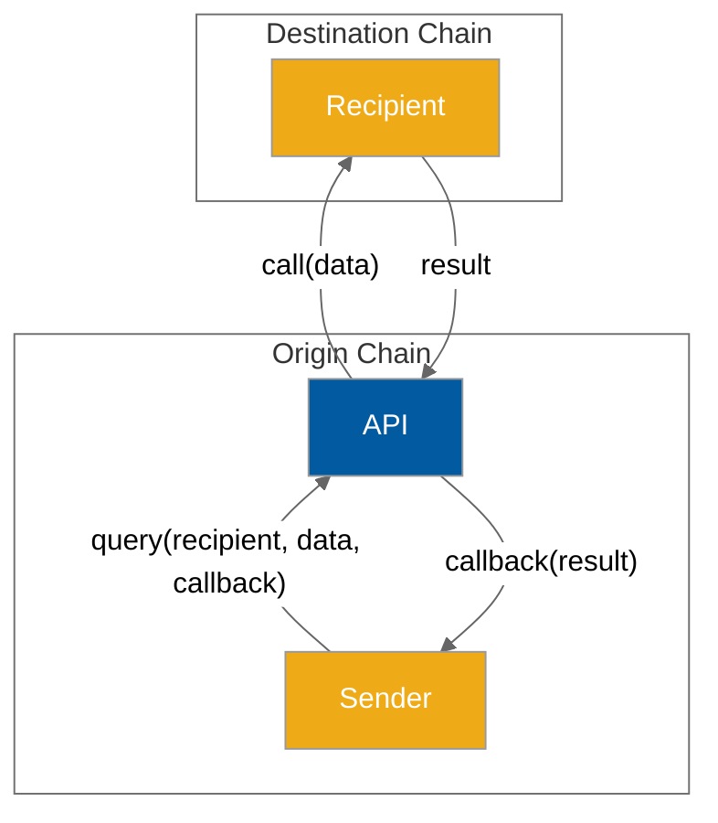
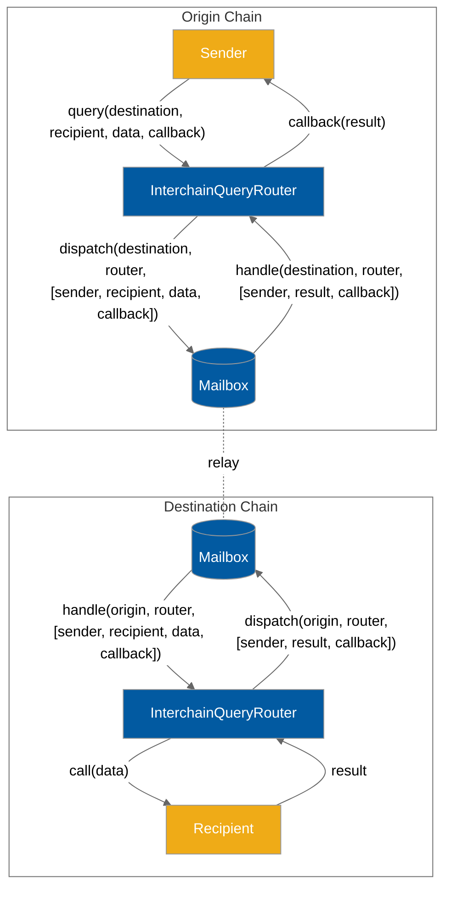

# Queries API

Developers can use the Queries API to query state on remote chains via interchain view calls.

Unlike the [messaging-api](messaging-api/ "mention"), which requires recipients to implement a specific interface, the Queries API allows developers to make view calls on any remote contract.

To use the Interchain Queries API, developers specify a remote chain, an ABI encoded view call to make on the remote chain, and an ABI encoded callback to be made on the querying contract, to which the return value of the remote view call will be appended.



### Interface

<pre class="language-solidity"><code class="lang-solidity">interface IInterchainQueryRouter {
    /**
     * @param _destinationDomain Domain of destination chain
     * @param target The address of the contract to query on destination chain.
     * @param queryData The calldata of the view call to make on the destination
<strong>     * chain.
</strong>     * @param callback Callback function selector on `msg.sender` and optionally
     * abi-encoded prefix arguments.
     * @return messageId The ID of the Hyperlane message encoding the query.
     */
    function query(
        uint32 _destinationDomain,
        address target,
        bytes calldata queryData,
        bytes calldata callback
    ) external returns (bytes32);

    /**
     * @param _destinationDomain Domain of destination chain
     * @param call The target address of the contract to query on destination
     * chain, and the calldata of the view call to make.
     * @param callback Callback function selector on `msg.sender` and optionally
     * abi-encoded prefix arguments.
     * @return messageId The ID of the Hyperlane message encoding the query.
     */
    function query(
        uint32 _destinationDomain,
        Call calldata call,
        bytes calldata callback
    ) external returns (bytes32);

    /**
     * @param _destinationDomain Domain of destination chain
     * @param calls Array of calls (to and data packed struct) to be made on
     * destination chain in sequence.
     * @param callbacks Array of callback function selectors on `msg.sender`
     * and optionally abi-encoded prefix arguments.
     */
    function query(
        uint32 _destinationDomain,
        Call[] calldata calls,
        bytes[] calldata callbacks
    ) external returns (bytes32);
}
</code></pre>

You can find the address of the `InterchainQueryRouter` contract on each chain [here](../resources/addresses.md#interchainqueryrouter), and chain domains [here](../resources/domains.md).

## Example Usage

### Encoding

Calls can be easily encoded with the `abi.encodeCall` function. As with the [accounts.md](accounts.md "mention"), you can either call `dispatch` directly or pass `Call` structs

```solidity
interface ENS {
    function ownerOf(uint256 label) external view returns (address);
    function nameExpires(uint256 label) external view returns (uint);
}

ENS ens = ENS(0x00000000000C2E074eC69A0dFb2997BA6C7d2e1e);
uint256 label = uint256(keccak256('hyperlane'));  // hyperlane.eth
Call ownerCall = Call({
    to: address(ens),
    data: abi.encodeCall(ens.ownerOf, (label));
});
Call nameExpiresCall = Call({
    to: address(ens),
    data: abi.encodeCall(ens.nameExpires, (label));
});
```

### Querying

Query the ENS contract on Ethereum for the owner and expiration time of the any domain (from any network), and write it to storage.

<pre class="language-solidity"><code class="lang-solidity"><strong>uint32 constant ethereumDomain = 1;
</strong>// consistent across all chains
address constant iqsRouter = 0x234b19282985882d6d6fd54dEBa272271f4eb784;
// The address of the ENS contract on Ethereum
address constant ens = 0x00000000000C2E074eC69A0dFb2997BA6C7d2e1e;

interface ENS {
    function ownerOf(uint256 label) external view returns (address);
}

// Stores the owners of queried ENS labels.
mapping(uint256 => address) owner;

/// @notice Only allow this function to be called via an IQS callback.
modifier onlyCallback() {
  require(msg.sender == iqsRouter);
  _;
}

/**
  * @notice Writes the result of an ENS label owner query.
  * Only callable as an IQS callback from a query initiated by this contract.
  * @param _label The ENS label
  * @param _owner The ENS label owner
  */
function writeOwner(uint256 _label, address _owner) onlyCallback() external {
  owner[_label] = _owner;
}

function queryEnsLabel(string memory _labelStr) external returns (bytes32) {
  ENS _ens = ENS(ens);
  uint256 _label = uint256(keccak256(_labelStr));
  Call _ownerCall = Call({
      to: address(ens),
      data: abi.encodeCall(ens.ownerOf, (_label));
  });
  // The return value of ownerOf() will be automatically appended when
  // making this callback
  bytes memory _callback = abi.encodePacked(this.writeOwner.selector, _label);
  // Dispatch the call. Will result in a view call of ENS.ownerOf() on Ethereum, 
  // and a callback to this.writeOwner(_label, _owner).
  return IInterchainQueryRouter(iqsRouter).query(
    ethereumDomain,
    _ownerCall,
    _callback
  );
}
</code></pre>

### Paying for Interchain Gas

Just like all Hyperlane messages that wish to have their messages delivered by a relayer, users must [pay for interchain gas](../build-with-hyperlane/guides/developers/paying-for-interchain-gas/).

The various `query` functions in the Queries API each return the message ID as a `bytes32`. This message ID can then be used by the caller to pay for interchain gas.

Because the Queries API uses the default ISM for security, the [`DefaultIsmInterchainGasPaymaster`](../resources/addresses.md#defaultisminterchaingaspaymaster)  should be used. When specifying the amount of gas, the caller must pay for a gas amount high enough to cover:

1. "Overhead" gas used by the Queries API contract on the destination chain. This is about **80,000 gas**.
2. The gas used by the user-specified arbitrary query / queries that will be performed on the destination chain.

The gas used by the callback when the query is returned to the origin chain does not need to be explicitly paid for.

#### Gas Payment Example

```solidity
function makeQuery(uint256 queryGasAmount) external payable {
    // First, send the query
    bytes32 messageId = IInterchainQueryRouter(iqsRouter).query(/* ... */);

    // Then, pay for gas

    // The mainnet DefaultIsmInterchainGasPaymaster
    IInterchainGasPaymaster igp = IInterchainGasPaymaster(
        0x56f52c0A1ddcD557285f7CBc782D3d83096CE1Cc
    );
    // Pay with the msg.value
    igp.payForGas{ value: msg.value }(
         // The ID of the message
         messageId,
         // Destination domain
         destinationDomain,
         // The total gas amount. This should be the
         // overhead gas amount (80,000 gas) + gas used by the query being made
         80000 + queryGasAmount,
         // Refund the msg.sender
         msg.sender
     );
}
```

### How it works



### Future Extensions

Create a cache for each destination chain contract that replicates queried state using historical calls as keys. This would enable atomic querying for calls which are recurring frequently. This would be especially useful for contracts which are queried frequently, such as ENS, Uniswap, and Compound.
