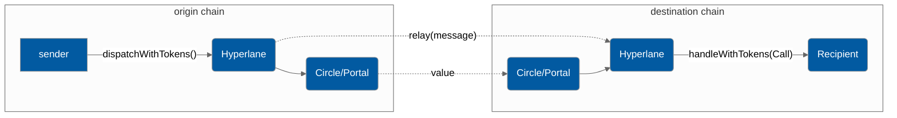

# Liquidity Layer API


The LiquidityLayer API is in beta and deployed only on testnet. The API is subject to change


Hyperlane's Liquidity layer will wrap around several token bridges to allow developers to send tokens alongside their message.



#### Supported Bridges

* Circle
  * Token: USDC
  * Chains: Goerli and Fuji
* Portal
  * Token: USDC, ETH
  * Chains: Goerli, Fuji, Mumbai, BSC Testnet, Alfajores

### Send

Developers can send interchain messages very similarly to the [messaging-api](messaging-api/ "mention") by calling the `LiquidityLayerRouter.dispatchWithTokens` endpoint. At the moment, dispatched messages must be received by a contract with the `handleWithTokens()` function. You will learn more about this in the [Receive](messaging-api/receive.md) section up next, but for now let's cover the message sending interface.

#### Interface

<!-- INCLUDE node_modules/@hyperlane-xyz/core/interfaces/ILiquidityLayerRouter.sol -->
<!-- END -->

The address of the `LiquidityLayerRouter` is `0x2abe0860D81FB4242C748132bD69D125D88eaE26` on every chain.

`_destinationDomain` is the chain you're sending to, it is **not** the chainID, rather it is a unique ID assigned by the protocol to each chain. Domain ID's can be found [here](../resources/domains.md).

`_recipientAddress` is the receiving contract, it needs to be a contract with the `handleWithTokens()` function, you can read about it in the [Receive](token-bridge-api.md#receive) section.

`_messageBody` is the message you're passing.&#x20;

`_token` is the address of the token on the origin chain you are trying to transfer

`_amount` is the amount of `_token` you want to transfer

`_bridge` is a string identifier for the value bridge you want to use, `"Circle"` or `"Portal"` are currently supported

### Receive

Like sending, receiving is very similar to the [messaging-api](messaging-api/ "mention"):thumbsup:

#### Interface

<!-- INCLUDE node_modules/@hyperlane-xyz/core/interfaces/ILiquidityLayerMessageRecipient.sol -->
<!-- END -->

`_origin` the Domain ID of the source chain, IDs found [here](../resources/domains.md#mainnet).

`_sender` the address of the message sender on the source chain

`_messageBody` the message being passed.

`_address` is the address of the token that was transferred to the recipient

`_amount` is the amount of the token that was transferred


The same points about access control and encoding from the [messaging-api](messaging-api/ "mention") apply to the LiquidityLayer API as well, so be sure to check it out. However, rather than requiring access control such that the Mailbox can only call the `handle` function, the LiquidityLayerRouter on the local chain must be the only address that can call the `handleWithTokens` function.

### Paying for Interchain Gas

Just like all Hyperlane messages that wish to have their messages delivered by a relayer, users must [pay for interchain gas](../build-with-hyperlane/guides/developers/paying-for-interchain-gas/).

The `dispatchWithTokens` function in the Liquidity Layer API returns the message ID as a `bytes32`. This message ID can then be used by the caller to pay for interchain gas.

Because the Liquidity Layer uses the default ISM for security, the [DefaultIsmInterchainGasPaymaster](../resources/addresses.md#defaultisminterchaingaspaymaster-1) IGP should be used. When specifying the amount of gas, the caller must pay for a gas amount high enough to cover:

1. "Overhead" gas used by the Liquidity Layer contract on the destination chain. This is about **280,000 gas**. This is because the actual cost of bridging the tokens via the underlying Circle or Portal bridge can be fairly high.
2. The gas used by the recipient's `handleWithTokens` function on the destination chain.

#### Gas Payment Example

```solidity
function dispatchWithTokensAndPayGas() external payable {
    // First, dispatch with tokens
    bytes32 messageId = liquidityLayer.dispatchWithTokens(/* ... */);

    // Then, pay for gas

    // The mainnet DefaultIsmInterchainGasPaymaster
    IInterchainGasPaymaster igp = IInterchainGasPaymaster(
        0x56f52c0A1ddcD557285f7CBc782D3d83096CE1Cc
    );
    // Pay with the msg.value
    igp.payForGas{ value: msg.value }(
         // The ID of the message
         messageId,
         // Destination domain
         destinationDomain,
         // The total gas amount. This should be the
         // overhead gas amount (280,000 gas) + gas used by the call being made.
         // For example, if the handleWithTokens function uses 120,000 gas,
         // we pay for 400k gas.
         400000,
         // Refund the msg.sender
         msg.sender
     );
}
```
