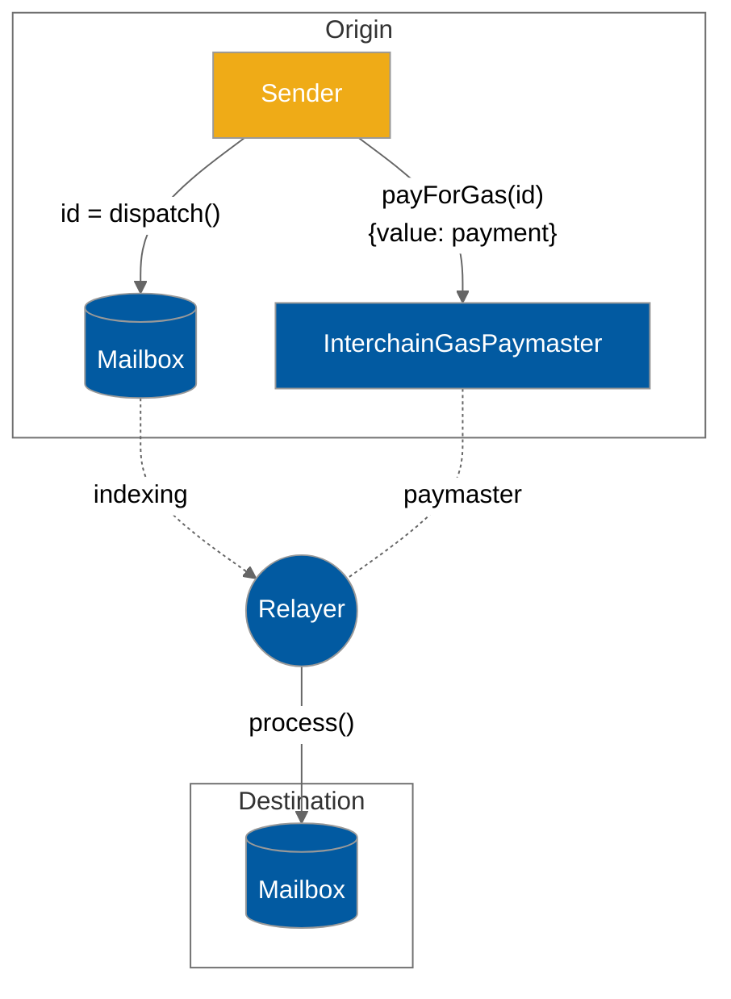

# Examples

### Application users paying interchain gas

This is an example showing how to have the caller of a function pay for a message's interchain gas. The `DefaultIsmInterchainGasPaymaster` is used.

Note if the caller of the function is paying for the message's interchain gas, the function must be payable!

```solidity
// The Mailbox (same address on all EVM chains)
IMailbox mailbox = IMailbox(0x35231d4c2D8B8ADcB5617A638A0c4548684c7C70);
// The mainnet DefaultIsmInterchainGasPaymaster
// (same address on all mainnet EVM chains)
IInterchainGasPaymaster igp = IInterchainGasPaymaster(
    0x56f52c0A1ddcD557285f7CBc782D3d83096CE1Cc
);

function sendAndPayForMessage() external payable {
    bytes32 messageId = mailbox.dispatch(/* ... */);
    igp.payForGas{ value: msg.value }(
        messageId, // The ID of the message that was just dispatched
        destinationDomain, // The destination domain of the message
        100000, // 100k gas to use in the recipient's handle function
        msg.sender // refunds go to msg.sender, who paid the msg.value
    );
}
```



### Paying interchain gas from a contract's own balance

It's also possible for a contract to pay for its own messages, for example:

```solidity
function contractPaysForItsOwnMessages() external {
    bytes32 messageId = mailbox.dispatch(/* ... */);

    // We're using the DefaultIsmInterchainGasPaymaster, so we specify
    // 100k gas to use in the recipient's handle function
    uint256 gasAmount = 100000; 
    // Get the required payment from the IGP.
    uint256 quotedPayment = igp.quoteGasPayment(
        destinationDomain,
        gasAmount
    );
    // Pay from the contract's balance
    igp.payForGas{ value: quotedPayment }(
        messageId, // The ID of the message that was just dispatched
        destinationDomain, // The destination domain of the message
        gasAmount,
        address(this) // refunds go to msg.sender, who paid the msg.value
    );
}

// so that the contract can receive native tokens, including refunds
receive() external payable {}
```
