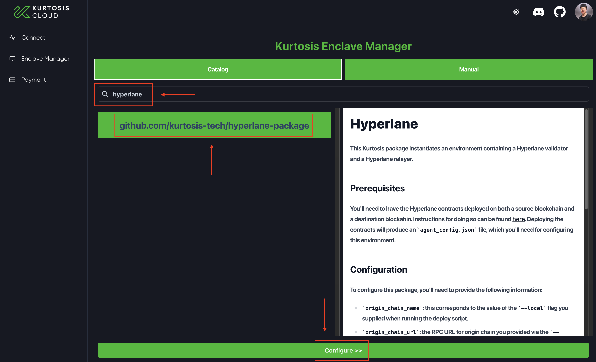
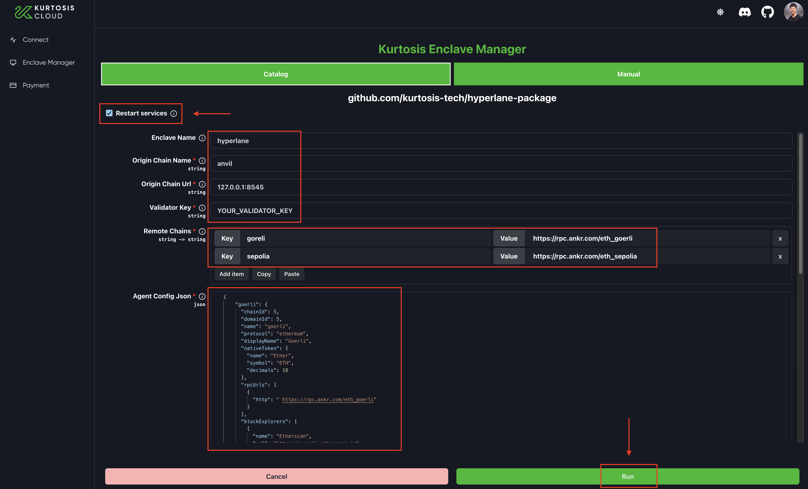

# Deploy Hyperlane

Hyperlane is designed to be deployed to new chains by anyone, at any time.&#x20;

This tutorial is intended for users who want to deploy Hyperlane to a new EVM chain.

By the end of this guide you will have deployed and configured the Hyperlane [messaging-api](../apis/messaging-api/ "mention"), allowing developers to send interchain messages to and from your chain.

At a high level, deploying Hyperlane requires the following actions:

1. [#1.-setup-keys](deploy-hyperlane.md#1.-setup-keys "mention") that you will use to deploy contracts and run validators and relayers
2. [#2.-deploy-contracts](deploy-hyperlane.md#2.-deploy-contracts "mention") to the local chain and to every remote chain with which the local chain will be able to send and receive messages.
3. [#3.-run-validators-and-relayers](deploy-hyperlane.md#3-run-validators-and-relayers "mention") to provide the signatures needed for the [sovereign-consensus](../protocol/sovereign-consensus/ "mention") you deployed and to send and receive between chains set up in the [#2.-deploy-contracts](deploy-hyperlane.md#2.-deploy-contracts "mention") step above.
4. [#5.-send-test-messages](deploy-hyperlane.md#5.-send-test-messages "mention") to confirm that your relayer is able to deliver messages from and to each pair of chains

## 1. Setup keys

In order to complete this guide, you first need to set up the following:

<table><thead><tr><th width="122.33333333333331">Key Type</th><th width="278">Description</th><th>Needs Funding?</th></tr></thead><tbody><tr><td>Contract Deployer</td><td>32 byte hexadecimal private key</td><td>Yes, on all the chains on which we need to deploy contracts.</td></tr><tr><td>Validator Accounts</td><td>A list of validator addresses for your local chain are needed to configure the <a data-mention href="../protocol/sovereign-consensus/multisig-ism.md">multisig-ism.md</a>s. The configuration is a list of <code>n</code> local validator addresses and the threshold <code>m</code>, the minimum number of validators needed to verify outbound messages from the local chain.</td><td>Yes, a small amount to do announce the location of the validator signatures (could be done by a different key in production)</td></tr><tr><td>Relayer Accounts</td><td>The relayer client(s) use one account on the local chain and an additional account for each of the remote chains. </td><td>Yes. Each relayer instance must be configured with a key that has a balance on all the other chains. Use the chains' faucet to get tokens if they are testnets, for the core chains, you can find a list of faucets under <a data-mention href="../resources/token-sources-and-faucets.md">token-sources-and-faucets.md</a>.</td></tr></tbody></table>

When testing out this guide, you can use the same hexadecimal key for all three roles for simplicity.


For instructions on how to generate keys, see [agent-keys](../operators/agent-keys/ "mention"). Your deployer key **must** be a hexadecimal key, while validator and relayer keys can be hexadecimal or AWS KMS.



If deploying on a local network using [Foundry's Anvil](https://github.com/foundry-rs/foundry), use the following command to fund your newly-generated account. It uses one of the pre-funded private keys to transfer 1 ETH to the address in the `$YOUR_PUBLIC_KEY` variable.

```
cast send $YOUR_PUBLIC_KEY \
--private-key 0xac0974bec39a17e36ba4a6b4d238ff944bacb478cbed5efcae784d7bf4f2ff80 \
--value $(cast tw 1)
```



[agent-keys](../operators/agent-keys/)



**Do not proceed to the next section until you have set up deployer, validator, and relayer keys.**


## 2. Deploy contracts

### Overview

In this step we will be deploying Hyperlane smart contracts to the local and remote chains.

On the local chain, we will deploy:

* The core contracts, including a [messaging.md](../protocol/messaging.md "mention") that can be used to send and receive messages

On all chains, we will deploy:

* A [multisig-ism.md](../protocol/sovereign-consensus/multisig-ism.md "mention") that can be used to verify inbound messages
* A [#interchaingaspaymasters](../protocol/interchain-gas-payments.md#interchaingaspaymasters "mention"), which can be used to pay our relayer for delivering interchain messages
* A `TestRecipient`, which we will send messages to, in order to test that everything is working correctly

### Setup


If you have not yet set up your deployer, validator, and relayer keys, see [#1.-setup-keys](deploy-hyperlane.md#1.-setup-keys "mention")


First, set up the `hyperlane-deploy` repo. This repo contain scripts to deploy Hyperlane contracts. You will need to install [`yarn`](https://yarnpkg.com/getting-started/install) if you haven't already.

```bash
git clone git@github.com:hyperlane-xyz/hyperlane-deploy.git
cd hyperlane-deploy
yarn install
```

Next, add a [`ChainMetadata`](https://github.com/hyperlane-xyz/hyperlane-monorepo/blob/main/typescript/sdk/src/consts/chainMetadata.ts#L21) entry for your local chain to `hyperlane-deploy/config/chains.ts`. An example has been populated for you for [`anvil`](https://book.getfoundry.sh/anvil/).&#x20;

Any chains that already have Hyperlane deployments do not need to be configured here (see [chainMetadata.ts](https://github.com/hyperlane-xyz/hyperlane-monorepo/blob/main/typescript/sdk/src/consts/chainMetadata.ts) for a list of chains for which metadata has already been provided).

```typescript
export const chains: ChainMap<ChainMetadata> = {
  // ----------- Your chains here -----------------
  anvil: {
    name: 'anvil',
    // anvil default chain id
    chainId: 31337,
    publicRpcUrls: [
      {
        http: 'http://localhost:8545',
      },
    ],
  },
};
```

Finally, add the `MultisigIsmConfig` entry for your local chain to `hyperlane-deploy/config/multisig_ism.ts`. An example with a single validator has been populated for you for `anvil`.&#x20;

Any chains that already have Hyperlane deployments do not need to be configured here (see [multisigIsm.ts](https://github.com/hyperlane-xyz/hyperlane-monorepo/blob/main/typescript/sdk/src/consts/multisigIsm.ts) for a list of chains for which ISM configs have already been provided).

```typescript
export const multisigIsmConfig: ChainMap<MultisigIsmConfig> = {
  // ----------- Your chains here -----------------
  anvil: {
    threshold: 1,
    validators: [
      // Last anvil address
      '0xa0ee7a142d267c1f36714e4a8f75612f20a79720',
    ],
  },
};
```

### Deploy

You can then run `yarn ts-node scripts/deploy-hyperlane.ts` to deploy the Hyperlane contracts. You will need to provide the following arguments:

* `local`: The local chain on which Hyperlane is being deployed
* `remotes`: The chains with which 'local' will be able to send and receive messages
* `key`: A hexadecimal private key for transaction signing

An example deployment command to `anvil` that supports communication with `goerli` and `sepolia` is shown below:

```bash
DEBUG=hyperlane* yarn ts-node scripts/deploy-hyperlane.ts --local anvil \
  --remotes goerli sepolia \
  --key 0x6f0311f4a0722954c46050bb9f088c4890999e16b64ad02784d24b5fd6d09061
```


The deploy script will only accept chains for which configuration has been provided. If you do not see your desired chain in the list of choices, you may be missing config in `chains.ts` or `multisig_ism.ts`


### Verify

If everything ran successfully, congrats! You should see contract addresses written to `artifacts/addresses.json`, and agent config written to `artifacts/agent_config.json`

```bash
$ head -n 19 artifacts/addresses.json
{
  "anvil": {
    "validatorAnnounce": "0x177B784C94d85f6645a35BfD14175D44045e573f",
    "proxyAdmin": "0x5Dfb392D946d0F3b6af599705541050A6ca6A870",
    "mailbox": "0x74756B469390CAee600F332184895ACbf86C4396",
    "multisigIsm": "0x1dD5a3E037be5C46839192a5b83a260166751409",
    "testRecipient": "0x7672E92386B49717D32946214A10B1988542F660",
    "storageGasOracle": "0xbA033019Fe072beda2389259e05bEB042bAb8fF6",
    "interchainGasPaymaster": "0x9368C1f2B6BE2869018622a9aB43a5D8ED27Fba2",
    "defaultIsmInterchainGasPaymaster": "0xc1FD390F3aB9d0e2bb8394B0DeCE48D31fC44121"
  },

$  head -n 22 artifacts/agent_config.json
{
  "chains": {
    "anvil": {
      "name": "anvil",
      "domain": 31337,
      "addresses": {
        "mailbox": "0x74756B469390CAee600F332184895ACbf86C4396",
        "interchainGasPaymaster": "0x9368C1f2B6BE2869018622a9aB43a5D8ED27Fba2",
        "validatorAnnounce": "0x177B784C94d85f6645a35BfD14175D44045e573f"
      },
      "signer": null,
      "protocol": "ethereum",
      "finalityBlocks": 1,
      "connection": {
        "type": "http",
        "url": ""
      },
      "index": {
        "from": 17
      }
    }
  },
```

## 3. Run validators and relayers

We've partnered with [Kurtosis](https://www.kurtosis.com/) to offer a smooth validator and relayer deployment experience through [Kurtosis Cloud](https://cloud.kurtosis.com/). This section of the guide will walk you through how to deploy a validator and relayer using the no-code, Kurtosis Cloud UI that connects Goerli to Polaris. 

If you wish to read more about validators and relayers, check out our docs on these topics at [Validators](../operators/validators/ "mention") and [Relayers](../operators/relayers/ "mention").

For feedback or questions about using Kurtosis in this section, please file a [Github Issue](https://github.com/kurtosis-tech/kurtosis/issues/new/choose) or start a [Github Discussion](https://github.com/kurtosis-tech/kurtosis/discussions/new?category=q-a). Alternatively, the Kurtosis team is available for technical support on their [Discord server](https://discord.com/invite/jJFG7XBqcY) as well.

### Log in to Kurtosis Cloud to provision an instance

To begin, visit the [Kurtosis Cloud website](https://cloud.kurtosis.com/) (direct link: https://cloud.kurtosis.com/) and sign in with Google. 

If this is the first time you're using Kurtosis Cloud, Kurtosis will automatically begin provisioning a remote cloud instance for your validator and relayer (see screenshot below). Provisioning should take only a few minutes.

<figure><figcaption><p>Kurtosis will provision a brand new instance for you if this is your first time using Kurtosis.</p></figcaption></figure>

Once complete, you will be prompted to interact with your new, empty cloud instance via the Enclave Manager or via the Kurtosis CLI. Go ahead and click on Launch in Enclave Manager (see screenshot below). 

<figure><figcaption><p>Launch the Enclave Manager to interact with your new Cloud instance.</p></figcaption></figure>

### Create the environment for your relayer and validator
Next, you'll see a page where you can select to view existing enclaves or to create a new one. An enclave can be thought of as an isolated environment with which you can deploy things on to. In this case, it will be the environment that houses your relayer and validator. Select "Create Enclave".

<figure><figcaption><p>Create a new enclave to house your relayer and validator.</p></figcaption></figure>

The next screen will be the Kurtosis Package catalog: a collection of runnable packages that anyone can write and use. Start typing "hyperlane" in the search box and you will see the Hyperlane package appear, with the format: `github.com/kurtosis-tech/hyperlane-package`. Go ahead and select that and choose "Configure" in the bottom of your screen.

<figure><figcaption><p>Select the Hyperlane package to configure and deploy</p></figcaption></figure>

### Configure and deploy your relayer and validator
You're almost done! Its now time to configure your relayer and validator. 

In this guide, you will check the `Restart services` box, fill in only the required fields, and paste in your `agent_config.json` file. When deploying Hyperlane for your own project, please use your own configuration values and any of the optional fields as you see fit. The below screenshot is an example configuration to show case how you would fill in the fields. Once you're all finished filling in the details, select `Run` on the bottom right!

<figure><figcaption><p>Configure your Hyperlane relayer and validator metadata, and click Run!</p></figcaption></figure>

Congratulations! You've now deployed your own Relayer and Validator on Kurtosis! You should be able to see the status and various metadata about your relayer and validators within the Enclave Manager UI. 

TODO: Screenshots of the Relayer and Validator views, and maybe one for logs.

## 5. Send test messages

You can check everything is working correctly by sending a test message between each pair of chains.

You can run `yarn ts-node scripts/test-messages.ts` to send test messages. You will need to provide the following arguments:

* `chains`: Test messages will be sent between each pair of these chains
* `key`: A hexadecimal private key for transaction signing

An example command that tests that messages can be sent between any pair of `anvil`, `goerli`, and `sepolia` is shown below:

```bash
DEBUG=hyperlane* yarn ts-node scripts/test-messages.ts \
  --chains anvil goerli sepolia \
  --key 0x6f0311f4a0722954c46050bb9f088c4890999e16b64ad02784d24b5fd6d09061
```


If everything ran successfully, congrats! You should something similar to the following output:

```bash
$ yarn ts-node scripts/test-messages.ts --chains anvil goerli --key 0x6f0311f4a0722954c46050bb9f088c4890999e16b64ad02784d24b5fd6d09060
Sent message from anvil to 0xBC3cFeca7Df5A45d61BC60E7898E63670e1654aE on goerli with message ID 0x5ad21a8dcfe2cd91d3e59e26f2ef7f01f6ab1850ef5922233c7776eacff8d8b0
Sent message from goerli to 0xBC3cFeca7Df5A45d61BC60E7898E63670e1654aE on anvil with message ID 0x27f8fcf9151c7bcc50408b2ca1df027346740f0b40b8e516b04b4a09a6757f69
Message from anvil to goerli with ID 0x5ad21a8dcfe2cd91d3e59e26f2ef7f01f6ab1850ef5922233c7776eacff8d8b0 has not yet been delivered
Message from goerli to anvil with ID 0x27f8fcf9151c7bcc50408b2ca1df027346740f0b40b8e516b04b4a09a6757f69 has not yet been delivered
Message from anvil to goerli with ID 0x5ad21a8dcfe2cd91d3e59e26f2ef7f01f6ab1850ef5922233c7776eacff8d8b0 has not yet been delivered
Message from goerli to anvil with ID 0x27f8fcf9151c7bcc50408b2ca1df027346740f0b40b8e516b04b4a09a6757f69 was delivered
Message from anvil to goerli with ID 0x5ad21a8dcfe2cd91d3e59e26f2ef7f01f6ab1850ef5922233c7776eacff8d8b0 was delivered
Testing complete
```

If you've waited a while and messages still aren't being delivered, take a look at the origin chain relayer logs and reach out on [discord](https://discord.gg/hyperlane).
