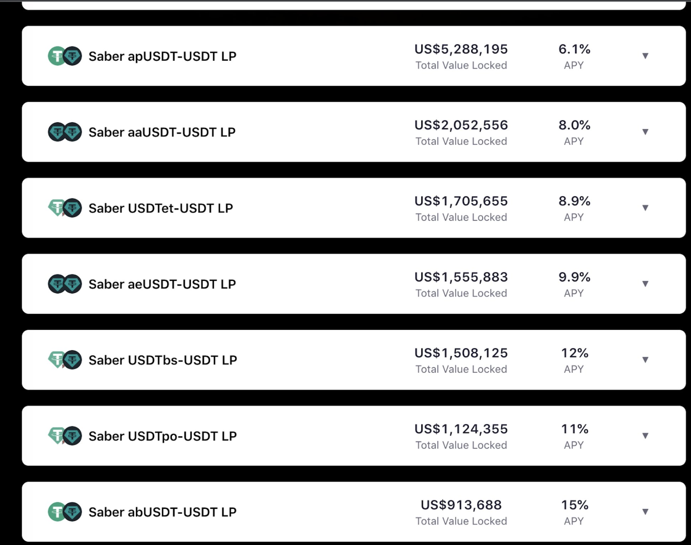

# Deploy Warp Route

Warp Routes are Hyperlane's unique take on the concept of token bridging, allowing you to permissionlessly bridge any ERC20-like asset to any chain via Hyperlane. You can combine Warp Routes with a Hyperlane deployment to create economic trade routes between any chain and others already connected through Hyperlane.

Once a Warp Route is created, the resulting asset is a true [Interchain Token](../../build-with-hyperlane/examples/erc20-token.md), meaning it can traverse between any Hyperlane connected chain with ease.&#x20;

This diagram below illustrates a fairly simplified overview of the flow in creating your Warp Route, and the resulting asset.&#x20;

<figure><figcaption></figcaption></figure>

Follow along to [deploy your first Warp Route](deploy-a-warp-route.md)

Then you can learn how to [deploy an easy to use UI for your Warp Route](deploy-the-ui-for-your-warp-route.md)
