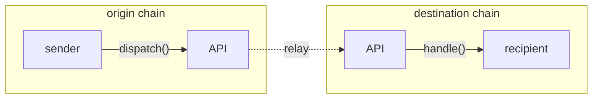

# Messaging API

Hyperlane provides an on-chain API for sending and receiving interchain messages.

Cant wait to get started? Follow [this tutorial](quickstart-tutorial.md) to send your first interchain message in less than five minutes. Otherwise, read on—

To send interchain messages, reference the [`Outbox.dispatch()` API](send.md).

To receive interchain messages, implement the [`IMessageRecipient.handle()`](receive.md) interface.

You can [unit test](unit-testing.md) your integration with the Hyperlane messaging API using the `MockOutbox` and `MockInbox` contracts.

Delivering an interchain message requires submitting a transaction on the destination chain. Optionally, you can pay for the gas for this transaction on the origin chain, and let a Hyperlane [relayer](../../protocol/agents/relayer.md) deliver your message for you.

Learn more about [interchain gas payments](gas.md).
