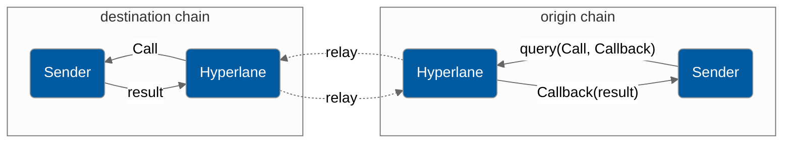

# Queries API

Developers can send cross chain view calls via Interchain Queries by calling the `InterchainQueryRouter.query` endpoint. In contrast with the [Messaging API](../messaging-api/send.md), the Interchain Queries API allows developers to send view calls to any contract, not just `IMessageRecipient`s with the `handle()` function, making it compatible with legacy contracts. To achieve this, message encoding must be constrained to ABI encoded function calls. Additionally, the `callback` functions must be defined on the interface of the querying contract for authentication purposes.



### Interface

```solidity
struct Call {
    address to;
    bytes data;
}

interface IInterchainQueryRouter {
    function query(
        uint32 _destinationDomain,
        Call calldata call,
        bytes calldata callback
    ) external;
    function query(
        uint32 _destinationDomain,
        Call[] calldata calls,
        bytes[] calldata callbacks
    ) external;
}
```

You can find the address of the `InterchainQueryRouter` contract on each chain [here](../addresses.md#interchainqueryrouter), and chain domains [here](../domains.md).

`_destinationDomain` is the chain you're sending to, it is **not** the chainID, rather it is a unique ID assigned by the protocol to each chain. Domain ID's can be found [here](../domains.md).

`calls` is an array of `Call` structs, each of which contains the address of the contract you're sending to, and the ABI encoded function call you're making. More on example usage below.

## Example Usage

### Encoding

Calls can be easily encoded with the `abi.encodeCall` function.

```solidity
interface ENS {
    function ownerOf(uint256 label) external view returns (address);
    function nameExpires(uint256 label) external view returns (uint);
}

ENS ens = ENS(0x00000000000C2E074eC69A0dFb2997BA6C7d2e1e);
uint256 label = ...;
uint256(keccak256('hyperlane'));  // hyperlane.eth
Call ownerCall = Call({
    to: address(ens),
    data: abi.encodeCall(ens.ownerOf, (label));
});
Call nameExpiresCall = Call({
    to: address(ens),
    data: abi.encodeCall(ens.nameExpires, (label));
});
```

### Querying

Query the ENS contract on Ethereum for the owner and expiration time of the any domain (from any network).

```solidity
uint32 constant ethereumDomain = 0x657468;
// consistent across all chains
address constant iqsRouter = 0xd09072A2a076671cf615EE3dDaBb71EcE00d7b38;
IInterchainQueryRouter(iqsRouter).query(
    ethereumDomain,
    [ownerCall, nameExpiresCall],
    [callback1, callback2]
);
```

### Future Extensions

Create a cache for each destination chain contract that replicates queried state using historical calls as keys. This would enable atomic querying for calls which are recurring frequently. This would be especially useful for contracts which are queried frequently, such as ENS, Uniswap, and Compound.
