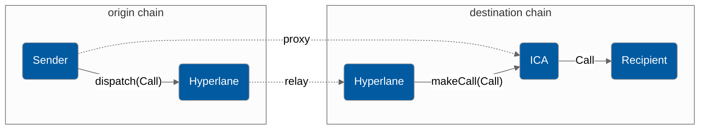

# Accounts API

Developers can send interchain messages via Interchain Accounts by calling the `InterchainAccountRouter.dispatch` endpoint. In contrast with the [Messaging API](../messaging-api/send.md), the Interchain Account API allows developers to send messages to any contract, not just `IMessageRecipient`s with the `handle()` function, making it compatible with legacy contracts. To achieve this, message encoding must be constrained to ABI encoded function calls.



If it does not exist already, an Interchain Account will be atomically created that is controlled by the sending address on the origin chain in perpetuity. The controlling pair of origin chain and address will have consistent interchain account addresses on all chains that support the Interchain Account specification.

### Interface

```solidity
interface IInterchainAccountRouter {
    function dispatch(
        uint32 _destinationDomain,
        address _target,
        bytes calldata data
    ) external;
    function getInterchainAccount(
        uint32 _originDomain, 
        address _sender
    ) external returns (address);
}
```

`InterchainAccountRouter` s can be found at `0xc011170d9795a7a2d065E384EAd1CA3394A7d35E` and chain domains [here](../domains.md).

`_destinationDomain` is the chain you're sending to, it is **not** the chainID, rather it is a unique ID assigned by the protocol to each chain. Domain ID's can be found [here](../domains.md).

`calls` is an array of `Call` structs, each of which contains the address of the contract you're sending to, and the ABI encoded function call you're making. More on example usage below.

## Example Usage

### Encoding

You can either pass a call directly in arguments to the `dispatch` function or construct an array of `Call` structs. Calls can be easily encoded with the `abi.encodeCall` function.

```solidity
interface IUniswapV3Pool {
    function swap(
        address recipient,
        bool zeroForOne,
        int256 amountSpecified,
        uint160 sqrtPriceLimitX96,
        bytes calldata data
    ) external returns (int256 amount0, int256 amount1);
}

IUniswapV3Pool pool = IUniswapV3Pool(...);
Call swapCall = Call({
    to: address(pool),
    data: abi.encodeCall(pool.swap, (...));
});
```

### Sending

Perform a Uniswap V3 swap on Ethereum via an Interchain Account from a controlling account on another chain. The Interchain Account must satisfy any requirements the recieving contract has on `msg.sender`, such as token balances or allowances.

```solidity
uint32 constant ethereumDomain = 0x657468;
 // consistent across all chains
address constant icaRouter = 0xc011170d9795a7a2d065E384EAd1CA3394A7d35E;
IInterchainAccountRouter(icaRouter).dispatch(
    ethereumDomain,
    address(pool),
    abi.encodeCall(pool.swap, (...))
);
```

### Precomputing Addresses

It is often useful to have knowledge of the Interchain Account address before sending a message. For example, you may want to fund the address with tokens before sending a message. The `getInterchainAccount` function can be used to get the address of an Interchain Account given the controlling chain domain and address pair.

An example is included below of a contract precomputing its own Interchain Account address.

```solidity
address myInterchainAccount = IInterchainAccountRouter(...).getInterchainAccount(
    localDomain,
    address(this)
);
```
