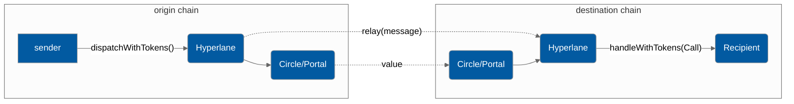

# Liquidity Layer API

Hyperlane's Liquidity layer will wrap around several token bridges to allow developers to send tokens alongside their message.



#### Supported Bridges

* Circle
  * Token: USDC
  * Chains: Goerli and Fuji
* Portal
  * Token: USDC, ETH
  * Chains: Goerli, Fuji, Mumbai, BSC Testnet, Alfajores

### Send

Developers can send interchain messages very similarly to the [messaging-api](../messaging-api/ "mention") by calling the `LiquidityLayerRouter.dispatchWithTokens` endpoint. At the moment, dispatched messages must be received by a contract with the `handleWithTokens()` function. You will learn more about this in the [Receive](../messaging-api/receive.md) section up next, but for now let's cover the message sending interface.

Note that the contract calling `dispatchWithTokens` must approve the Liquidity Layer Router to be able to spend at least `_amount` of the token `_token` owned by the calling contract.

#### Interface

```solidity
interface ILiquidityLayerRouter {
    function dispatchWithTokens(
        uint32 _destinationDomain,
        bytes32 _recipientAddress,
        bytes calldata _messageBody,
        address _token,
        uint256 _amount,
        string calldata _bridge
    ) external returns (uint256);
}
```

The address of the LiquidityLayerRouter is `0x3428e12EfDb2446c1E7feC3f1CED099A8a7cD541`  on every chain.

`_destinationDomain` is the chain you're sending to, it is **not** the chainID, rather it is a unique ID assigned by the protocol to each chain. Domain ID's can be found [here](../../developers-faq-and-troubleshooting/domains.md).

`_recipientAddress` is the receiving contract, it needs to be a contract with the `handleWithTokens()` function, you can read about it in the [Receive](./#receive) section.

`_messageBody` is the message you're passing.&#x20;

`_token` is the address of the token on the origin chain you are trying to transfer

`_amount` is the amount of `_token` you want to transfer

`_bridge` is a string identifier for the value bridge you want to use, `"Circle"` or `"Portal"` are currently supported

### Receive

Like sending, receiving is very similar to the [messaging-api](../messaging-api/ "mention"):thumbsup:

#### Interface

```solidity
interface ILiquidityLayerMessageRecipient {
    function handleWithTokens(
        uint32 _origin,
        bytes32 _sender,
        bytes calldata _message,
        address _token,
        uint256 _amount
    ) external;
}
```

`_origin` the Domain ID of the source chain, IDs found [here](../../developers-faq-and-troubleshooting/domains.md#mainnet).

`_sender` the address of the message sender on the source chain

`_messageBody` the message being passed.

`_address` is the address of the token that was transferred to the recipient

`_amount` is the amount of the token that was transferred


The same point about access control and encoding from the [messaging-api](../messaging-api/ "mention") apply to the LiquidityLayer API as well, so be sure to check it out. However, rather than requiring access control such that the Mailbox can only call the `handle` function, the LiquidityLayerRouter on the local chain must be the only address that can call the `handleWithTokens` function.

The address of the LiquidityLayerRouter is `0x3428e12EfDb2446c1E7feC3f1CED099A8a7cD541` on all supported chains.
