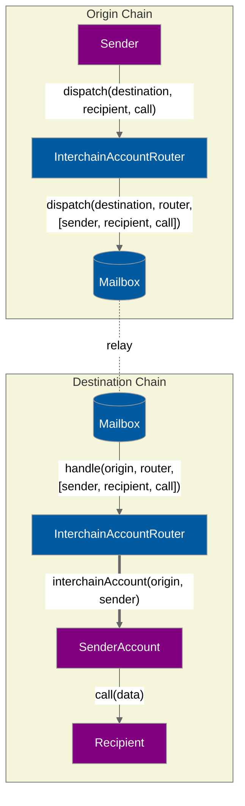

```mermaid
%%{ init: {
  "theme": "neutral",
  "themeVariables": {
    "mainBkg": "#025AA1",
    "textColor": "white",
    "clusterBkg": "beige"
  },
  "themeCSS": ".edgeLabel { color: black }"
}}%%

flowchart TB
    subgraph Origin Chain
      Sender
      A_O[InterchainAccountRouter]
      M_O[(Mailbox)]
    end

    subgraph Destination Chain
      M_D[(Mailbox)]
      A_D[InterchainAccountRouter]
      SenderAccount
      Recipient
    end

    Sender -- "dispatch(destination, recipient, call)" --> A_O
    A_O -- "dispatch(destination, router, \n[sender, recipient, call])" --> M_O
    M_O -. "relay" .- M_D
    M_D -- "handle(origin, router, \n[sender, recipient, call])" --> A_D
    A_D == "interchainAccount(origin, sender)" ==> SenderAccount
    SenderAccount -- "call(data)" --> Recipient
    
    click A_O https://github.com/hyperlane-xyz/hyperlane-monorepo/blob/main/solidity/contracts/middleware/InterchainAccountRouter.sol
    click A_D https://github.com/hyperlane-xyz/hyperlane-monorepo/blob/main/solidity/contracts/middleware/InterchainAccountRouter.sol

    style Sender fill:purple
    style SenderAccount fill:purple
    style Recipient fill:purple
```