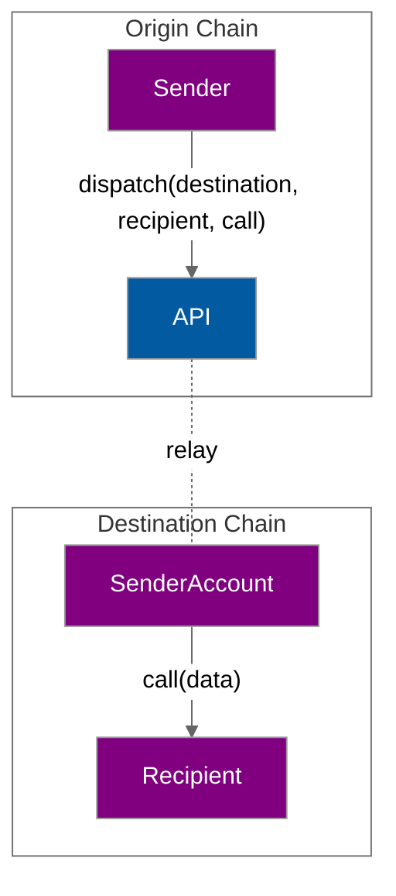

```mermaid
%%{ init: {
  "theme": "neutral",
  "themeVariables": {
    "mainBkg": "#025AA1",
    "textColor": "white",
    "clusterBkg": "white"
  },
  "themeCSS": ".edgeLabel { color: black }"
}}%%

flowchart TB
    subgraph Origin Chain
      Sender
      A_O[API]
    end

    subgraph Destination Chain
      SenderAccount
      Recipient
    end

    Sender -- "dispatch(destination, recipient, call)" --> A_O
    A_O -. "relay" .- SenderAccount
    SenderAccount -- "call(data)" --> Recipient

    click A_O https://github.com/hyperlane-xyz/hyperlane-monorepo/blob/main/solidity/contracts/middleware/InterchainAccountRouter.sol
    click A_D https://github.com/hyperlane-xyz/hyperlane-monorepo/blob/main/solidity/contracts/middleware/InterchainAccountRouter.sol

    style Sender fill:purple
    style SenderAccount fill:purple
    style Recipient fill:purple
```