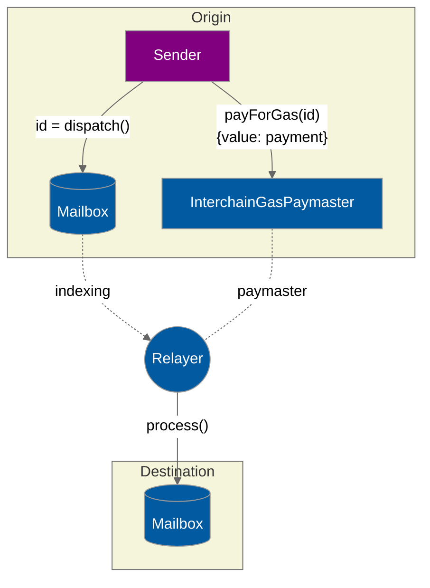

```mermaid
%%{ init: {
  "theme": "neutral",
  "themeVariables": {
    "mainBkg": "#025AA1",
    "textColor": "white",
    "clusterBkg": "beige"
  },
  "themeCSS": ".edgeLabel { color: black }"
}}%%

flowchart TB
    subgraph Origin
      Sender
      style Sender fill:purple
      M_O[(Mailbox)]
      IGP[InterchainGasPaymaster]
      click IGP https://github.com/hyperlane-xyz/hyperlane-monorepo/blob/main/solidity/contracts/igps/InterchainGasPaymaster.sol
      Sender -- "id = dispatch()" --> M_O
      Sender -- "payForGas(id)\n{value: payment}" --> IGP
    end

    Relayer((Relayer))

    M_O -. "indexing" .-> Relayer
    IGP -. "paymaster" .- Relayer

    subgraph Destination
      M_D[(Mailbox)]
    end

    Relayer -- "process()" --> M_D
```
