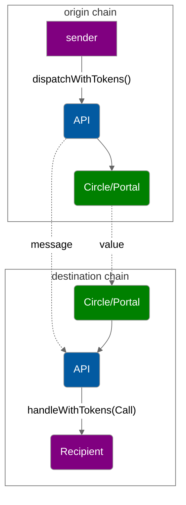

```mermaid
%%{ init: {
  "theme": "neutral",
  "themeVariables": {
    "mainBkg": "#025AA1",
    "textColor": "white",
    "clusterBkg": "white"
  },
  "themeCSS": ".edgeLabel { color: black }"
}}%%

flowchart TB
	subgraph origin chain
		sender --"dispatchWithTokens()"--> HypO(API)
        HypO --> AdapterO(Circle/Portal)
        
	end

	HypO -."message".-> HypD
	AdapterO -."value".-> AdapterD
    

	subgraph destination chain
        AdapterD(Circle/Portal) --> HypD
    

		HypD(API) --"handleWithTokens(Call)"--> recipient(Recipient)
	end

  style sender fill:purple
  style recipient fill:purple
  style AdapterO fill:green
  style AdapterD fill:green
```
