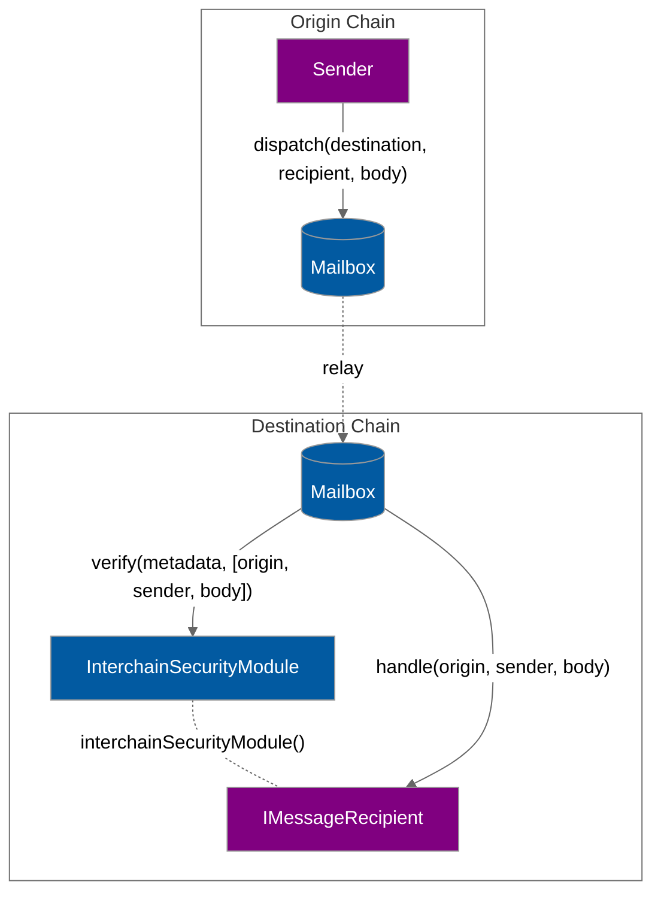

```mermaid
%%{ init: {
  "theme": "neutral",
  "themeVariables": {
    "mainBkg": "#025AA1",
    "textColor": "white",
    "clusterBkg": "white"
  },
  "themeCSS": ".edgeLabel { color: black }"
}}%%

flowchart TB
    subgraph Origin Chain
      Sender
      M_O[(Mailbox)]
      Sender -- "dispatch(destination, recipient, body)" --> M_O
    end

    subgraph Destination Chain
      ISM[InterchainSecurityModule]
      Recipient[IMessageRecipient]
      M_D[(Mailbox)]

      M_D -- "verify(metadata, [origin, sender, body])" --> ISM
      ISM -. "interchainSecurityModule()" .- Recipient
      M_D -- "handle(origin, sender, body)" --> Recipient

    end

    M_O -. "relay" .-> M_D

    click M_O https://github.com/hyperlane-xyz/hyperlane-monorepo/blob/main/solidity/contracts/Mailbox.sol
    click ISM https://github.com/hyperlane-xyz/hyperlane-monorepo/blob/main/solidity/contracts/isms/InterchainSecurityModule.sol
    click Recipient https://github.com/hyperlane-xyz/hyperlane-monorepo/blob/main/solidity/interfaces/IMessageRecipient.sol
    click M_D https://github.com/hyperlane-xyz/hyperlane-monorepo/blob/main/solidity/contracts/Mailbox.sol

    style Sender fill:purple
    style Recipient fill:purple
```
