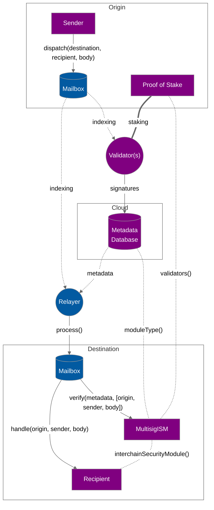

```mermaid
%%{ init: {
  "theme": "neutral",
  "themeVariables": {
    "mainBkg": "#025AA1",
    "textColor": "white",
    "clusterBkg": "white"
  },
  "themeCSS": ".edgeLabel { color: black }"
}}%%

flowchart TB
    V(("Validator(s)"))
    Relayer((Relayer))

    subgraph Origin
      Sender
      M_O[(Mailbox)]
      POS[Proof of Stake]

      Sender -- "dispatch(destination, recipient, body)" --> M_O
    end

    subgraph Cloud
      aws[(Metadata\nDatabase)]
    end

    M_O -. "indexing" .-> Relayer
    M_O -. "indexing" .-> V
    POS == "staking" === V

    V -- "signatures" --> aws

    subgraph Destination
      Recipient
      M_D[(Mailbox)]
      ISM[MultisigISM]

      M_D -- "verify(metadata, [origin, sender, body])" --> ISM
      M_D -- "handle(origin, sender, body)" --> Recipient
      ISM -. "interchainSecurityModule()" .- Recipient
    end

    Relayer -- "process()" --> M_D

    aws -. "metadata" .-> Relayer
    aws -. "moduleType()" .- ISM

    POS -. "validators()" .- ISM

    click ISM https://github.com/hyperlane-xyz/hyperlane-monorepo/blob/main/solidity/contracts/isms/MultisigIsm.sol

    style Sender fill:purple
    style Recipient fill:purple
    style V fill:purple
    style ISM fill:purple
    style aws fill:purple
    style POS fill:purple
```