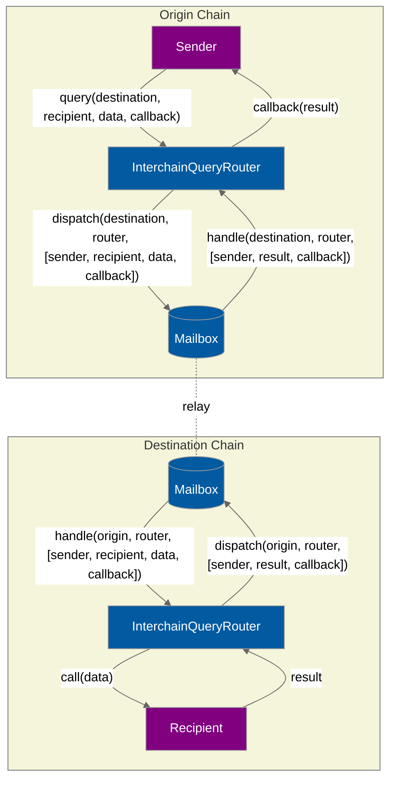

```mermaid
%%{ init: {
  "theme": "neutral",
  "themeVariables": {
    "mainBkg": "#025AA1",
    "textColor": "white",
    "clusterBkg": "beige"
  },
  "themeCSS": ".edgeLabel { color: black }"
}}%%

flowchart TB
    subgraph Origin Chain
      Sender
      Q_O[InterchainQueryRouter]
      M_O[(Mailbox)]
    end

    subgraph Destination Chain
      M_D[(Mailbox)]
      Q_D[InterchainQueryRouter]
      Recipient
    end

    Sender -- "query(destination, recipient, data, callback)" --> Q_O
    Q_O -- "dispatch(destination, router, \n[sender, recipient, data, callback])" --> M_O
    M_O -. "relay" .- M_D
    M_D -- "handle(origin, router, \n[sender, recipient, data, callback])" --> Q_D
    Q_D -- "call(data)" --> Recipient
    Recipient -- "result" --> Q_D
    M_O -- "handle(destination, router, \n[sender, result, callback])" --> Q_O
    Q_D -- "dispatch(origin, router, \n[sender, result, callback])" --> M_D
    Q_O -- "callback(result)" --> Sender

    click Q_O https://github.com/hyperlane-xyz/hyperlane-monorepo/blob/main/solidity/contracts/middleware/InterchainQueryRouter.sol
    click Q_D https://github.com/hyperlane-xyz/hyperlane-monorepo/blob/main/solidity/contracts/middleware/InterchainQueryRouter.sol

    style Sender fill:purple
    style Recipient fill:purple
```