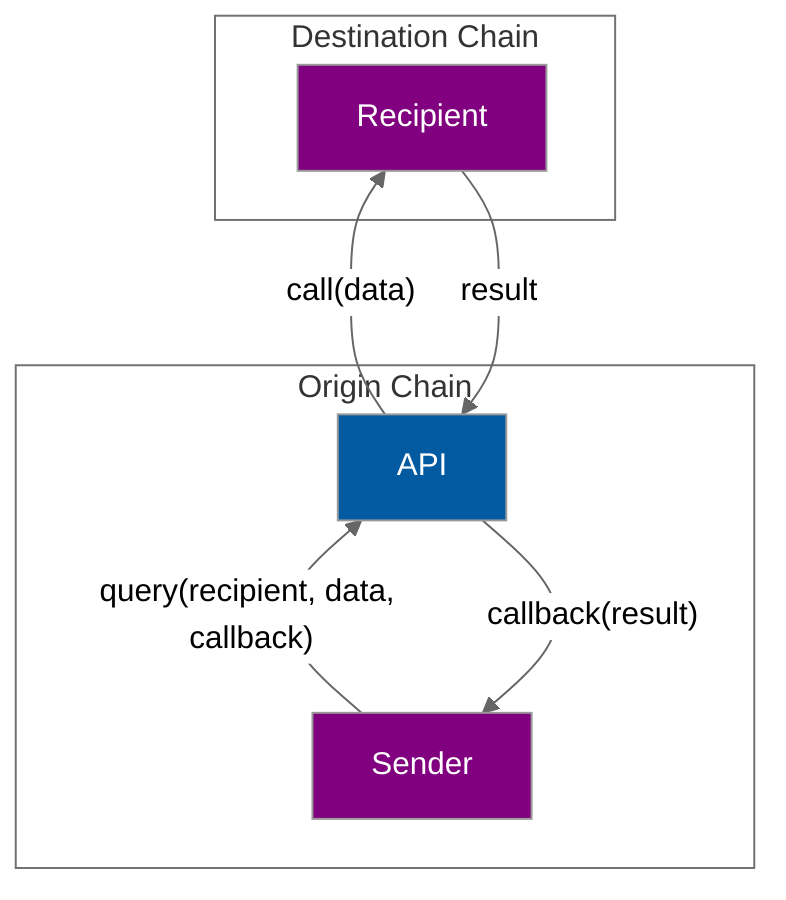

```mermaid
%%{ init: {
  "theme": "neutral",
  "themeVariables": {
    "mainBkg": "#025AA1",
    "textColor": "white",
    "clusterBkg": "white"
  },
  "themeCSS": ".edgeLabel { color: black }"
}}%%

flowchart BT
    subgraph Origin Chain
      Sender
      Q_O[API]
    end

    subgraph Destination Chain
      Recipient[Recipient]
    end

    Sender -- "query(recipient, data, callback)" --> Q_O
    Recipient -- "result" --> Q_O
    Q_O -- "call(data)" --> Recipient
    Q_O -- "callback(result)" --> Sender

    click Q_O https://github.com/hyperlane-xyz/hyperlane-monorepo/blob/main/solidity/contracts/middleware/InterchainQueryRouter.sol
    click Q_D https://github.com/hyperlane-xyz/hyperlane-monorepo/blob/main/solidity/contracts/middleware/InterchainQueryRouter.sol

    style Sender fill:purple
    style Recipient fill:purple
```