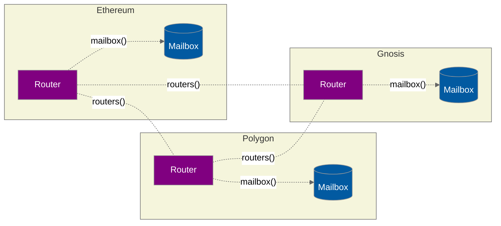

```mermaid
%%{ init: {
  "theme": "neutral",
  "themeVariables": {
    "mainBkg": "#025AA1",
    "textColor": "white",
    "clusterBkg": "beige"
  },
  "themeCSS": ".edgeLabel { color: black }"
}}%%

graph LR
    subgraph "Ethereum"
        R_E[Router]
        Mailbox_E[(Mailbox)]
        R_E -. "mailbox()" .-> Mailbox_E
    end

    subgraph "Polygon"
        R_P[Router]
        Mailbox_P[(Mailbox)]
        R_P -. "mailbox()" .-> Mailbox_P
    end

    subgraph "Gnosis"
        R_G[Router]
        Mailbox_G[(Mailbox)]
        R_G -. "mailbox()" .-> Mailbox_G
    end

    R_E -. "routers()" .- R_P
    R_P -. "routers()" .- R_G
    R_G -. "routers()" .- R_E

    style R_E fill:purple
    style R_P fill:purple
    style R_G fill:purple
```
