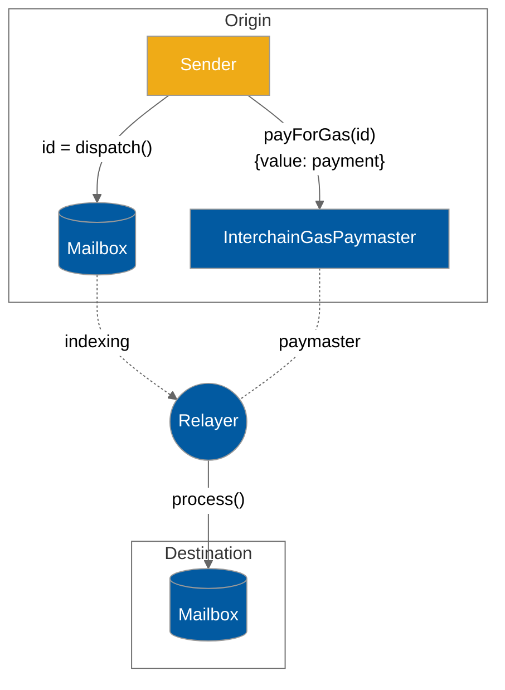

# Relayers

Hyperlane [relayers](../../protocol/agents/relayer.md) deliver interchain messages to their recipients.

Every Hyperlane message requires two transactions to be delivered, one on the origin chain to [dispatch](../../apis-and-sdks/messaging-api/send.md) the message, and one on the destination chain to [process](../../apis-and-sdks/messaging-api/receive.md) the messages. Relayers are responsible for sending the second transaction.

Hyperlane relayers are run on a per-origin-chain basis, delivering outbound messages from that chain to one or more remote chains. Relayers have no special permissions in Hyperlane. If relayer keys are compromised, only the tokens held by those keys are at risk.

Running a relayer requires the following:

#### RPC nodes

Relayers use RPC nodes to read the origin chain, and deliver messages to the destination chain(s). Relayers must be configured with an RPC node for the origin chain, and each destination chain.

#### One or more signing keys

In order to deliver messages, relayers must be configured with a signing key for each destination chain.

The relayer uses this key to sign `Mailbox.process()` transactions. The Hyperlane relayer agent currently supports configuration with AWS KMS keys that are accessed via API keys/secrets or raw hexadecimal private keys.

#### A machine to run on

Relayers can compile the Rust binary themselves, or run a Docker image provided by Abacus Works. The binary can be run using your favorite cloud service.
