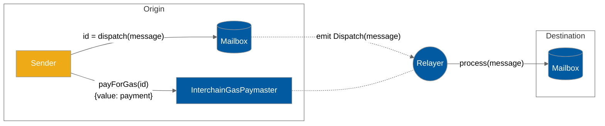

# Interchain gas payments

Successful interchain messages require two transactions; one on the origin chain to send the message, and one on the destination chain to deliver the message.

For convenience, Hyperlane provides an on-chain API on the origin chain that allows message senders to pay one or more [relayers](../operators/relayers/ "mention") to deliver a message on the destination chain. This payment is called an interchain gas payment.

## InterchainGasPaymasters

Interchain gas payments are facilitated by `InterchainGasPaymaster` (IGP) smart contract contracts.

These contracts expose the [interchain-gas-paymaster-api.md](../apis-and-sdks/interchain-gas-paymaster-api.md "mention"), which allows users to pay [relayer.md](agents/relayer.md "mention") with native tokens on the origin chain to cover the costs of delivering a message on the destination chain.

Each `InterchainGasPaymaster` contract corresponds to exactly one relayer. You can find addresses of the Abacus Works' relayer under [addresses.md](../resources/addresses.md "mention")

### Gas oracles

In order to support the [interchain-gas-paymaster-api.md](../apis-and-sdks/interchain-gas-paymaster-api.md "mention"), IGP contracts may be configured with gas oracles, which are responsible for tracking remote token gas prices and exchange rates.

This allows the `quoteGasPayment` function to provide an accurate quote for the price of gas on a remote chain, denominated in the local chain's native token.

Eventually, relayers will be able to automatically update their gas oracles in order to ensure that their IGP always quotes a fair price for remote gas.

## Trust assumptions

Interchain gas payments are based on a social contract between the message sender and relayer.&#x20;

In other words, a relayer may receive interchain gas payments without delivering the corresponding messages.

Therefore, when making interchain gas payments, it is recommended to use an IGP contract that is associated with a known and reputable relayer.

An honest relayer implementation will honor any successful gas payments made to its IGP, no matter how many tokens were actually paid. By keeping [#gas-oracles](interchain-gas-payments.md#gas-oracles "mention") up to date, the relayer can ensure that gas payments succeed if and only if a "fair" price was paid.

There are no trust assumptions with respect to relayers in the Hyperlane protocol, and under no circumstances will a malicious relayer be able to censor or falsify messages. The worst thing that a relayer can do is accept payments without delivering a message.

