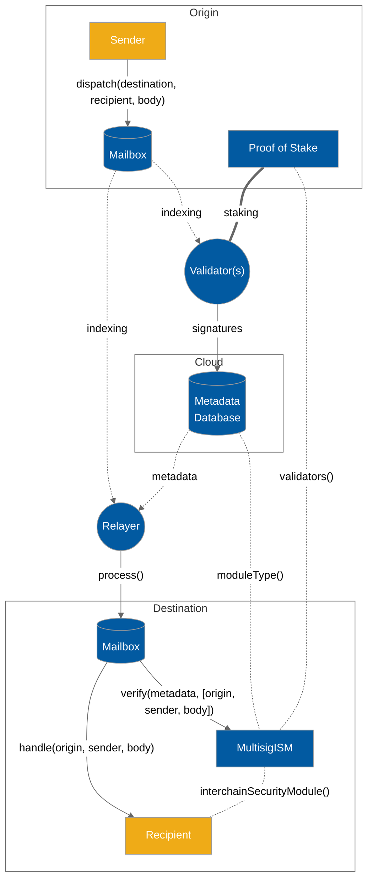

# Mailbox

The Hyperlane`Mailbox` smart contracts expose an on-chain API for sending and receiving interchain messages. There is a `Mailbox` contract deployed on every chain Hyperlane supports.

The network of `Mailboxes` facilitates the connective tissue between blockchains that developers leverage to create interchain applications, and add interchain functionality to their existing applications. If you'd like to learn more about them, read on!

## Interface

The `IMailbox` interface exposes two state-mutating functions; `dispatch()` and `process()`.

```solidity
// SPDX-License-Identifier: MIT OR Apache-2.0
pragma solidity >=0.8.0;

interface IMailbox {
    function dispatch(
        uint32 _destinationDomain,
        bytes32 _recipientAddress,
        bytes calldata _messageBody
    ) external returns (bytes32);

    function process(bytes calldata _metadata, bytes calldata _message)
        external;
}
```

### Dispatch

To send interchain messages, developers call `Mailbox.dispatch()`.

This function takes as parameters the message contents, the destination chain ID, and the recipient address. Each message get inserted as a leaf into an [incremental merkle tree](https://medium.com/@josephdelong/ethereum-2-0-deposit-merkle-tree-13ec8404ca4f) stored by the `Mailbox`.

Hyperlane's [proof-of-stake.md](proof-of-stake.md "mention") protocol uses this merkle tree to verify fraud proofs.

### Process

To deliver interchain messages, [relayer.md](agents/relayer.md "mention")call `Mailbox.process()`.

This function takes as parameters the message to deliver as well as arbitrary metadata that can be specified by the relayer.

The `Mailbox` will pass the message and metadata to one or more [interchain-security-modules.md](sovereign-consensus/interchain-security-modules.md "mention") for verification. If the ISM successfully verifies the message, the `Mailbox` delivers the message to the recipient by calling `recipient.handle()`.


See [`Message.sol`](https://github.com/hyperlane-xyz/hyperlane-monorepo/blob/main/solidity/contracts/libs/Message.sol)for more details on Hyperlane message encoding&#x20;


## Message lifecycle

The diagram below illustrates the lifecycle of an interchain message being sent from "Sender" to "Recipient", secured using a [multisig-ism.md](sovereign-consensus/multisig-ism.md "mention").


