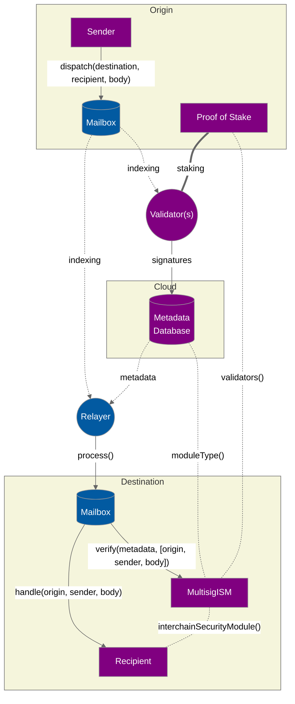

# Mailboxes

The messaging API is powered by `Mailbox` smart contracts, which expose an on-chain API for sending and receiving interchain messages. A `Mailbox` is deployed on every chain Hyperlane supports.

The network of `Mailboxes` facilitates the connective tissue between blockchains that developers leverage to create interchain applications, and add interchain functionality to their existing applications. If you'd like to learn more about them, read on!

## Dispatch

To send interchain messages, developers call `Mailbox.dispatch()`.

This function takes as parameters the message contents, the destination chain ID, and the recipient address. Each message get inserted as a leaf into an [incremental merkle tree](https://medium.com/@josephdelong/ethereum-2-0-deposit-merkle-tree-13ec8404ca4f). Storing messages in a merkle tree allows Hyperlane's [proof-of-stake](proof-of-stake.md) protocol to trustlessly verify fraud proofs.

```solidity
/**
  * @notice Dispatch the message it to the destination domain & recipient
  * @param _destinationDomain Domain of destination chain
  * @param _recipientAddress Address of recipient on destination chain as bytes32
  * @param _messageBody Raw bytes content of message
  * @return A unique message ID.
  */
function dispatch(
  uint32 _destinationDomain,
  bytes32 _recipientAddress,
  bytes calldata _messageBody
) external returns (bytes32);
```

### Process

[Relayers](agents/relayer.md) deliver messages to their recipients by calling `Mailbox.process()`.

This function takes as parameters the message to deliver as well as arbitrary metadata that can be specified by the relayer. The `Mailbox` will pass the message and metadata to the recipient's `Interchain Security Module` for validation.

If accepted, the `Mailbox` delivers the message to the recipient by calling `recipient.handle()`.

```solidity
/**
  * @notice Attempts to deliver `message` to the recipient.
  * @param _metadata Arbitrary metadata that can be injected by a relayer,
  * used by the ISM to verify the validity of `_message`.
  * May include things like validator signatures, merkle proofs,
  * zero-knowledge proofs of light client state, etc.
  * @param _message Hyperlane formatted interchain message.
  */
  function process(bytes calldata _metaData, bytes calldata _message) external;
```


See [`Message.sol`](https://github.com/hyperlane-xyz/hyperlane-monorepo/blob/main/solidity/contracts/libs/Message.sol)for more details on Hyperlane message encoding.


## Message lifecycle

The diagram below illustrates the lifecycle of an interchain message being sent from "Sender" to "Recipient", secured using a validator-based ISM.

// <!-- INCLUDE diagrams/multisig-pos-ism.md -->
<!-- WARNING: copied from the included file path. Do not edit directly. -->

<!-- WARNING: copied from the included file path. Do not edit directly. -->
<!-- END -->
