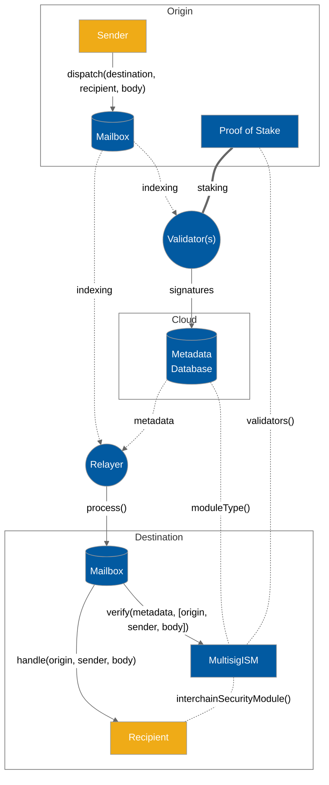

# Overview

Hyperlane is a generalized interchain messaging protocol that empowers developers to send messages from one blockchain to another. Messages can contain any arbitrary bytes, and are not limited to text. They can be used to transfer any information between blockchains. They can allow you to move around value, execute function calls, and many other things that allow for the creation of interchain applications, apps that can be accessed by users on any blockchain.

Users interface with the Hyperlane protocol via [messaging.md](messaging.md "mention") smart contracts, which provide an on-chain [messaging-api](../apis/messaging-api/ "mention") to send and receive interchain messages.

Hyperlane takes a modular approach to [sovereign-consensus](sovereign-consensus/ "mention"), allowing applications to configure and choose from a selection of [interchain-security-modules.md](sovereign-consensus/interchain-security-modules.md "mention") (ISMs). Applications may specify an ISM to customize the security model that secures their integration with the Hyperlane messaging API.

