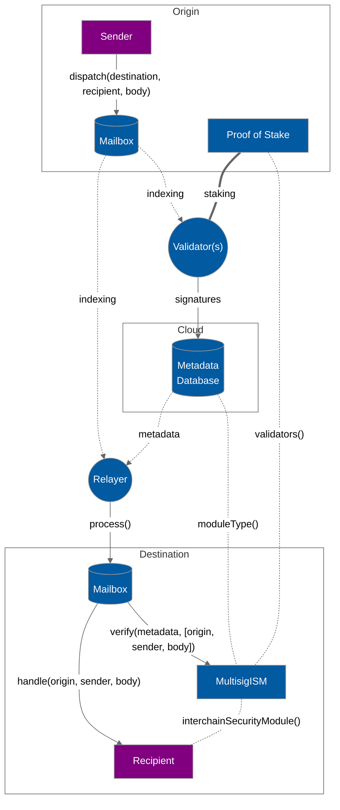

# Sovereign consensus

Sovereign consensus allows applications to configure and choose from a selection of **Interchain Security Modules**, smart contracts that define a security model for interchain messaging.

Applications can use sovereign consensus to tune security models and trust assumptions to best fit their needs. A heterogenous ecosystem of interchain security models allows for fault isolation and maximizes Hyperlane's decentralization.

Sovereign consensus is entirely optional. [`Mailboxes`](messaging.md) will default to a module that leverages the economic security provided by [proof-of-stake](proof-of-stake.md).

<!-- INCLUDE diagrams/messaging-isms.md -->
<!-- END -->

### Interchain security modules

Interchain security modules (ISMs) are smart contracts that define the security model for an application.

ISMs must implement the `verify()` interface, which gets called by the `Mailbox` before delivering a message. If `verify()` does not return true, the transaction will revert.

<!-- INCLUDE node_modules/@hyperlane-xyz/core/interfaces/IInterchainSecurityModule.sol -->
<!-- WARNING: copied from the included file path. Do not edit directly. -->
```solidity
// SPDX-License-Identifier: MIT OR Apache-2.0
pragma solidity >=0.6.11;

interface IInterchainSecurityModule {
    /**
     * @notice Returns an enum that represents the type of security model
     * encoded by this ISM.
     * @dev Relayers infer how to fetch and format metadata.
     */
    function moduleType() external view returns (uint8);

    /**
     * @notice Defines a security model responsible for verifying interchain
     * messages based on the provided metadata.
     * @param _metadata Off-chain metadata provided by a relayer, specific to
     * the security model encoded by the module (e.g. validator signatures)
     * @param _message Hyperlane encoded interchain message
     * @return True if the message was verified
     */
    function verify(bytes calldata _metadata, bytes calldata _message)
        external
        returns (bool);
}

interface ISpecifiesInterchainSecurityModule {
    function interchainSecurityModule()
        external
        view
        returns (IInterchainSecurityModule);
}

```
<!-- WARNING: copied from the included file path. Do not edit directly. -->
<!-- END -->

Applications can opt into sovereign consensus by implementing the `interchainSecurityModule()`, which returns the address of the ISM being used by the application.

This model allows for varying levels of customization. Developers that want minimal customization can use the default ISM or point to an already deployed contract. Developers that want more control over security can deploy and configure their own ISM, or even write one from scratch.

### Examples

A few types of ISMs are described below for illustrative purposes. Eventually, we plan to deploy pre-configured instances of each of these that developers can choose from. Alternatively, developers can deploy and configure their own ISM instances.

**Multisig:** A simple t-of-n security model. A proof-of-stake adapter contract could be used to vary the membership to reflect the Hyperlane validators that provide the most economic security.

<!-- INCLUDE diagrams/multisig-pos-ism.md -->
<!-- WARNING: copied from the included file path. Do not edit directly. -->

<!-- WARNING: copied from the included file path. Do not edit directly. -->
<!-- END -->

**Optimistic:** A model pioneered by [Optics](https://docs.celo.org/protocol/bridge/optics) that prioritizes safety over liveness, optimistic ISMs encode a fraud window during which 1-of-n parties can halt the system.

**Dynamic:** ISMs that vary their configuration (or underlying security model) over time based on message content or application state.
